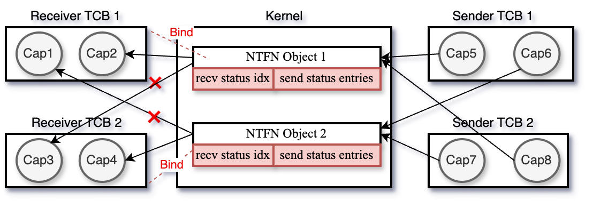

# 摘要

以seL4为代表的现代微内核操作系统将同步IPC作为进程间通信的主要方式，同时借助需要内核转发的通知机制来实现用户态的中断处理和异步通信。然而随着微内核生态的发展，部分应用需要进行大量而频繁的系统调用和IPC，然而微内核支持的同步系统调用和IPC导致了大量的上下文切换和二级缓存失效，同时由于同步调用的阻塞等待导致系统无法充分利用多核的性能；虽然微内核对异步信号有一定的支持，但仍需要内核进行转发，其中的上下文切换和缓存失效在某些平台和场景下将造成不可忽视的开销。

本文聚焦微内核的异步通信机制，基于用户态中断技术，通过兼容capability机制和异步通信接口来改造seL4的通知机制，提出U-notification，使得信号无需通过内核转发，减少上下切换的开销。同时利用U-notification，借助共享内存和Rust对异步编程的支持，设计了无需陷入内核的异步系统调用和异步IPC框架，在提升用户态并发度的同时，减少用户态和内核态的切换次数，根据设计我们在FPGA上实现了ReL4，将IPC性能最高提升了387.8%，在IPC频繁的系统中（如网络服务器）将吞吐量最高提升了15%。

关键词：微内核；异步；用户态中断。

# 1. 引言

微内核从被提出以来，最大的性能瓶颈就是进程间通信（IPC），30年前Liedtke提出的L4通过对内核系统的重新设计，证明了微内核的IPC也可以很快，之后以seL4为代表的现代微内核的IPC框架也基本延续了最初的L4，以同步IPC作为主要的通信方式，同时引入异步的通知机制来简化多线程程序设计，提升多核的利用率。然而随着软硬件生态的发展，seL4中的IPC通信方式并不能很好的满足部分应用的性能要求。首先是软件对系统有了新的要求，随着软件复杂性的提升，系统级软件如数据库管理系统、网络服务器等，需要进行大量的系统调用和IPC，这要求系统能够以快速高效的形式处理大量系统调用和IPC，而微内核将操作系统的大部分服务（如网络协议栈、文件系统等）移到用户态，从而使得IPC数量和频率激增，内核态与用户态之间的特权级切换成为性能瓶颈。此外，新出现的硬件漏洞如Meltdown 和 Spectre漏洞促使 Linux 使用 KPTI 补丁来分离用户程序和内核的页表，进一步增加了陷入内核的开销，seL4 中也有类似的机制。最后，外设速度越来越快，而现代微内核的外设驱动往往存在于用户态，外设中断被转化为通知信号，需要用户态驱动主动陷入内核来进行接收，这在一定程度上成为了外设驱动的性能瓶颈。

综上所述，以seL4为代表的现代微内核在IPC和系统调用架构的设计上仍然有很大的上下文切换开销，主要体现在集中在两个地方：1）通知机制需要内核转发。2）系统调用和同步IPC需要频繁的出入内核。大量而频繁的特权级切换成为了系统的性能瓶颈。

我们的方法：在这篇文章中，我们提出了ReL4，一个用Rust编写的基于用户态中断的高性能异步微内核，它利用用户态中断技术设计了U-notificaiton，在兼容capability的基础上改造微内核的通知机制，并利用改造后的U-notification和共享内存设计和实现了一套绕过内核的异步IPC框架。从广义的角度来看，系统调用作为一种特殊的IPC形式，我们同样借助IPC框架对系统调用进行异步化改造，从而设计和实现了一个完全异步的微内核架构。

这里有一些挑战需要被注意到：
- 用户态中断虽然与通知机制的作用相似，但对于通信权限的控制如何与capability机制兼容，以及中断的抢占式行为与notification的主动询问的用法如何进行兼容，仍然需要我们进行仔细的设计。
- 用户态中断的开销小于特权级切换，但仍然对程序局部性和内存缓存不够友好，因此我们需要尽可能减少用户态中断的次数。
- 由于内核往往与用户态程序共用CPU核心，因此对于异步系统调用，在不破坏微内核已有的任务特权级机制前提下，内核如何快速高效地执行异步系统调用请求，从而尽可能地利用CPU资源值得我们深入思考。

为了评估我们的设计与实现，我们在ReL4上评估了不同负载下单次IPC的平均开销，同时在ReL4上搭建了一个TCP服务器和一个用户内存分配用于评估系统的整体性能。经测试，我们在FPGA上将IPC性能最高提升了387.8%，在IPC频繁的系统中（如网络服务器）将吞吐量最高提升了15%。

本文将从背景、系统设计、实现细节、性能评估四个方面介绍我们的工作。

# 2. 背景

现代微内核的大部分IPC优化始于Liedtke提出的L4，L4通过组合系统调用的方式减少不必要的内核陷入开销，通过消息寄存器避免内存拷贝，通过同步IPC减少等待时间和上下文切换的开销，通过快速路径的方式减少IPC内核路径。与前几代微内核相同，为了遵循微内核的最小化原则，原始的微内核仅支持同步IPC，但后续的实践证明了同步IPC强制用户对原本简单的系统进行多线程设计，导致线程同步变得复杂，例如：由于缺乏类似于Unix中select功能，每个中断源都需要一个单独的线程。此外，同步IPC强制非依赖关系的IPC调用以顺序的形式进行，无法充分利用硬件的并行性。L4-embedded通过在内核中新增非阻塞的通知机制来解决这个问题，其在seL4中被完善为一组二进制信号量的数组，通知对象通过非阻塞操作来发送信号，而接收端可以通过轮询或阻塞等待信号来检查通知字。此外，内核通过该方式将硬件中断传递到用户态，从而方便了用户态驱动的框架设计与实现。尽管严格来说通知机制不是最小化的（因为它可以通过同步IPC机制模拟实现），但它对于减少用户态开发复杂性、充分利用硬件并发性起着至关重要的作用。此外，随着访存速度的加快，L4中通过物理的消息寄存器进行零拷贝优化的方案带来的收益逐渐削弱，相反使用物理寄存器导致的平台依赖和编译器优化失效问题极大地限制了系统的性能，因此纷纷被现代微内核以虚拟消息寄存器的方式所替代。原始L4微内核使用临时内存映射的方式避免长消息的内存拷贝，但由于在内核中引入了缺页异常的可能性，增加了内核行为的复杂性，现代微内核纷纷放弃了长消息的传递，一般通过通知机制和共享内存组合的方式来进行长消息的传递。

上述的研究和优化方案大都聚焦于IPC的内核路径优化，通过避免IPC路径的解码和调度流程，减少内存拷贝等方式来减少IPC的性能开销，也已经取得了很大的成果，事实上，在其最简单的情况下，同步IPC仅仅是一个上下文的切换，甚至不会改变消息寄存器。然而，随着内核路径开销越来越少，上下文切换的开销变得无法忽略，特别是对于有频繁的短消息传递和频繁的系统调用的应用，用户态-内核态的上下文切换开销已经成为限制系统性能的最大瓶颈。现代微内核在软件上通过消息寄存器的方式减少上下文切换的大小，从而在一定程度上减少了上下文切换的开销；通过组合Send & Recv系统调用（以及Recv & Reply）减少陷入内核的次数；在硬件上通过利用ASID减少块表的冲刷频率，从而减小页表的切换开销，这些方法虽然都在一定程度上减少了上下文切换的开销，但无法彻底消除。

先前已经有很多研究表明特权级切换会给各类应用场景带来显著的开销，包含了直接开销和间接开销。
- 直接开销：由于特权级的切换需要执行额外的指令来保存寄存器、切换保护域等。
- 间接开销：特权级的切换会导致CPU的数据缓存、指令缓存、快表（TLB）被污染，同时为了保证顺序执行，指令的乱序执行会被暂停，流水线将被排空，从而导致特权级切换后的每周期指令执行数（IPC）将会锐减。

此外，为了应对硬件漏洞产生的Meltdown 和 Spectre v3a 等攻击，内核页表隔离技术（KPTI）被广泛应用于各个微内核。内核和应用程序使用两组页表来进行隔离，因此应用在进行系统调用和IPC时，至少会切换两次或四次页表。除了KPTI，虚拟化也可能增加上下文的切换开销，由于虚拟机检查的页表条目比物理机更多，因此TLB miss的概率更高。

先前已经有大量的工作致力于减少系统调用中的特权级切换开销，主要分为两类。

- 第一类方法通过将用户态和内核态的功能扁平化来减少内核与用户态的切换开销，如unikerel将所有用户态代码都映射到内核态执行，Userspace Bypass通过动态二进制分析将两个系统调用之间的用户态代码移入内核态执行，从而减少陷入内核的次数，kernel bypass则通过将硬件驱动（传统内核的功能）移入用户态，从而减少上下文的切换。这些方法要么需要特殊的硬件支持，要么难以与微内核的设计理念兼容，因此都只能提供一定的参考价值。

- 第二类方法则是允许用户空间对多个系统调用请求排队，并仅通过一个系统调用来将他们注册给内核。如FlexSC通过在用户态设计一个用户态线程的运行时，将用户态线程发起的系统调用自动收集，然后陷入内核态进行批量执行。该方法虽然可以有效的减少陷入内核的次数，但如何设置提交的时机难以把握，过短的提交间隔将导致切换次数增加，过长的提交间隔则会导致空闲的CPU空转。

<table>
    <tr>
        <th>优化方法</th><th>详细分类</th></th><th>实例</th><th>缺点</th>
    </tr>
    <tr>
        <td rowspan="3">减少内核路径</td><td>惰性调度 </td><td rowspan="1"> ---- </td> <td rowspan="3"> 上下文切换开销已经成为性能瓶颈 </td>
    </tr> 
    <tr>
        <td>快速路径</td><td rowspan="2"> ----
    </tr>
    <tr>
        <td>消息寄存器</td>
    </tr>
    <tr>
        <td rowspan="5">减少上下文切换开销 </td> <td> 消息寄存器 </td>  <td rowspan="2"> ---- </td> <td rowspan="3"> 无法从根本上消除切换开销 </td>
    </tr>
    <tr>
        <td>组合系统调用</td>
    </tr>
    <tr>
        <td>ASID机制</td> <td> ---- </td>
    </tr>
    <tr>
        <td>统一地址空间</td> <td> ---- </td>  <td rowspan="2"> 与微内核设计理念相悖，无法有效地实施到微内核中 </td>
    </tr>
    <tr>
        <td>批量系统调用</td> <td> ---- </td> 
    </tr>
</table>

综上所述，上述方法要么无法彻底消除上下文切换的性能瓶颈，要么无法有效地实施到微内核中。随着硬件的不断发展，用户态中断——一种新兴的硬件技术方案逐渐被各个硬件平台（x86、RISC-V）采纳并很好地解决了上述提到的问题。用户态中断通过硬件转发的方式，在无需陷入内核的情况下，将信号发送给其他用户态程序。该机制仅需在通信注册过程中陷入内核，以分配用于通信的相关硬件资源，后续的通信过程无需内核介入，很好地避免了用户态和内核态的上下文切换。目前已经在Sapphire Rapids x86处理器上和RISCV的N扩展中有支持。

# 3. 设计

基于上述背景，我们利用用户态中断技术，通过兼容capability机制和异步通信接口来改造微内核的通知机制，使得信号无需通过内核转发，减少上下切换的开销。同时利用无需内核转发的通知机制，借助共享内存和Rust对异步编程的支持，设计了无需陷入内核的异步系统调用和异步IPC框架，在提升用户态并发度的同时，减少用户态和内核态的切换次数，最终提升系统的整体性能。下面是我们的设计目标：
- 利用用户态中断改造微内核的通知机制，在减少特权级的切换次数，提升系统性能的同时兼容原始的通信接口，保证兼容性。
- 利用共享内存和Rust语言协程机制自动收集IPC请求和系统调用请求并进行异步处理，提升系统并发性。
- 根据系统负载来动态选择通知内核/接收线程的时机，充分利用CPU资源。

## 3.1 U-notification
微内核中的通知机制通过一个特殊的内核对象(notification)来实现，在内核对象中保存了相关的通知状态位，同时将对象的不同能力句柄暴露给不同的线程。持有能力具柄的线程可以根据句柄的权限来选择对应的操作。

从图中可以看出，在原始的通知机制中，通信的权限控制图是一个冗余的连通图，只要拥有合适的capability，所有的Sender TCB可以通过任意一个notificaiton对象向任意一个Receiver TCB发送通知，反之也成立。而在被用户态中断改造的U-notification中，由于接收端对TCB的独占性，导致了Receiver TCB对其他notification object的连接边失效，但由于原始连通图的冗余性，新的权限控制图仍然是连通图，保持了通信权限控制的完备性。

U-notification相比于原始的通知机制在通信能力方面仍然有一些不同，主要是以下两点：
- 原始的通知机制允许多个接收线程接收同一个内核对象上的通知，这种设计违反了功能单一的软件设计原则，而由于U-notification中接收端对接收线程的独占性，这个能力将不再被支持。
- 原始的通知机制允许单个接收线程接收多个内核对象上的通知，这种设计的目的是更灵活地支持多发送端的场景，然而用同一个内核对象的不同badge已经足够支持区分多发送端，而在U-notification中使用中断号来区分不同发送端。

除了权限控制有所不同之外，改造前后的通信方式也有所区别。原始的通知机制需要用户态通过系统调用主动询问内核是否有信号需要处理，根据是否将线程阻塞，一般被区分为两个接口Wait和Poll。而U-notification无需接收线程主动陷入并询问内核，接收线程随时被硬件发起的用户态中断打断，并处理到来的信号，这在很大程度上解放了接收线程，程序设计者无需关心信号到来的时机，减少了CPU忙等的几率，提升了接收线程的并发度。

相应的，为了提升U-notification的易用性，我们需要对原始的通信接口进行兼容：
- Poll：无需陷入内核态，在用户态读取中断寄存器中是否有有效中断并返回即可。
- Wait：在没有有效中断时将阻塞当前协程并切换到其他协程执行，等待用户态中断唤醒。

## 3.2 异步IPC
 

异步IPC的核心在于消息传递（数据通路）和异步任务调度（控制通路）。共享内存用于消息传递拥有零拷贝开销的优势，但需要我们手动管理共享内存的数据结构，并在合适的时机通知对方进行读取，尽可能避免数据竞争。而异步运行时则为系统提供了一个高并发的执行环境，避免了上下文无关的IPC相互阻塞，从而提升CPU的利用率。下面我们将从共享内存和异步运行时来介绍我们的异步IPC框架。

### 3.2.1 共享内存

- IPCItem：为了减少消息读写以及编解码的成本，我们采用定长的消息字段。每个消息（IPCItem）的长度被定义为缓存行的整数倍，并进行对齐。消息中前4个字节用于存储提交该请求对应的协程号，方便后续唤醒。剩下的字节将被具体的应用程序用于专用的用途。
- ItemsQueue：一个读写安全的环形队列，请求和响应分别在两个不同的唤醒队列中，由不同的线程进行读写，为了提高效率，我们采用无锁的方式进行实现。
- co_status：为了更好地把握通知对方进行数据读取的时机，我们需要在共享内存中维护双方用于接收请求/响应的协程状态。
为了简化设计，同时减少共享内存的数据竞争，每个环形队列只绑定一个发送端线程和一个接收端线程，即ItemsQueue被设计为一个无锁的单生产者单消费者唤醒队列。一个发送线程如果需要同多个接收线程通信，需要注册不同的共享内存缓冲区。
### 3.2.2 异步运行时

用户态程序将以协程的形式发起IPC请求，异步运行时首先会根据请求的数据和协程的协程号生成IPCItem并写入请求的环形队列中，然后检查共享缓冲区的 `req_co_status` 标志位，如果对方的接收协程在线，那我们无需通知对方线程，对方线程的异步运行时会在某个时刻调度到该协程并读取请求进行处理。如果对方的接收协程不在线，则异步运行时会发送U-notification通知对方线程将接收协程给环形并重启调度。客户端线程和服务端线程在双方建立连接时都会注册一个接收协程用于不断从缓冲区的环形队列中读取数据并进行处理。我们分别对服务端和客户端的接收协程提供了两个默认实现：
- 服务端：读取请求并处理后将响应写入唤醒队列，并根据标志位判断是否发送U-notification，没有请求时阻塞切换。
- 客户端：读取响应并唤醒响应的协程，没有响应时阻塞切换。

对于特殊的需求，用户程序可以通过运行时接口自定义接收协程的行为。

## 3.3 异步系统调用

从广义上看，系统调用属于一种特殊的IPC，即接收端为内核，以seL4为代表的现代微内核大多将内核实现为互斥访问，即每次只有一个CPU核心能够进入内核，对于共享内存的访问符合单生产者单消费者的抽象。因此我们将异步IPC框架扩展到异步系统调用中来，在内核中设计了一套相似的异步运行时以支持异步系统调用。此外，用户态的异步运行时包含了一套重新实现的系统调用库，用于以相同的函数接口替换同步系统调用。异步系统调用库会将系统调用参数和当前的用户协程号封装为一个IPCItem并写入请求的ItemsQueue中。同时根据内核中接收协程的就绪状态来判断是否需要陷入到内核中去唤醒该协程。当前核心只需要在内核返回响应之前等待或执行其他用户态协程即可。

异步系统调用与异步IPC的主要不同之处有两点：
- 由于接收端是内核，发送端无法使用U-notificaiton去通知内核。
- 异步IPC中接收线程的调度器执行时机就是线程的执行主体，而内核除了异步任务的调度器需要执行，本身就有如中断、异常、任务调度等其他任务需要被执行。

对于第一点，我们只需要新增一个系统调用去用于唤醒相关的内核协程即可。而对于第二点，一个很容易想到的异步任务执行时机是每次时钟中断到来时，然而这可能会导致空闲的CPU核心无法及时收到通知而空转，因此，在不破坏原本的任务优先级前提下，使用核间中断来抢占空闲核心或正在低优先级任务的核心，才能更好地利用CPU资源，减少响应时延。

我们在内核中维护了每个核心的执行优先级(exec_prio)，一共分为三类：
- idle_thread: 核心正在执行idle线程，此时核心的执行优先级为256，最低优先级。
- 内核态：正在处理中断、异常、系统调用等，此时核心的执行优先级为0，最高优先级，不可被抢占。
- 用户态任务：正在执行用户态的任务，此时核心的执行优先级为用户线程的优先级，可以被更高优先级线程提交的异步系统调用请求打断。
当发送端通过系统调用陷入内核去唤醒相应协程后，会检查当前线程的优先级是否可以抢占其他核心，如果可以，则发送核间中断抢占该核心去执行异步系统调用，当前核心则返回用户态继续执行其他协程。如果没有可以被抢占的核心，则在下一次时钟中断到来时执行异步系统调用请求。
# 4. 实现
我们使用Rust语言在RISC-V平台上实现了一个兼容seL4的微内核ReL4，目前已经支持SMP架构和fastpath优化。在兼容seL4原始功能的基础上，我们在ReL4实现了U-notificaiton以及异步IPC和异步系统调用。在实现过程中对内核的接口更改和使用的一些重要优化手段将在本章描述。
- 新增系统调用

| Syscall                   | Args                 | Details                                        |
| ------------------------- | -------------------- | ---------------------------------------------- |
| UintrRegisterSender       | ntfn_cap             | 注册发送端，传入U-notification对象的能力句柄                  |
| UintrRegisterReceiver     | ntfn_cap             | 注册接收端，传入U-notification对象的能力句柄                  |
| UintrRegisterAsyncSyscall | ntfn_cap, buffer_cap | 注册异步系统调用的处理协程，传入响应U-notifcaiton的能力句柄和共享内存的能力句柄 |

- 自适应的混合轮询
虽然用户态中断的开销小于特权级切换，但仍然对程序局部性和内存缓存不够友好，而轮询虽然可以避免用户态中断，但却会导致CPU资源的浪费，因此我们实现了共享内存中设置了接收协程的状态标志位，用于判断是否需要发送用户态中断来对原本轮询的接收协程进行唤醒。此外，我们在提供接收协程的默认实现之外，还提供了用户自定义的接口。接收协程的默认实现会在队列中没有数据时将自己阻塞掉，因此当接收端线程的负载较大时，随着数据源源不断到来，接收协程将以轮询的方式工作，而当接收放线程负载较小时，接收端处理数据的速度大于发送端发送数据的速度，发送端将频繁地发送U-notification，接收协程将以中断的方式进行工作。

- 优先级机制
在我们的用户态运行时中，已经至少有三种不同的异步任务：1）用户定义的普通协程，2）接收异步请求和响应协程， 3）外部中断到来时的处理协程。这三种不同的异步任务在处理时应当拥有不同的优先级，以达到系统的最佳利用率，因此要求我们的调度器需要对任务优先级有相应的支持。当然，如果要支持具有优先级的IPC和系统调用，除了异步任务调度器的支持还不够，共享内存中也需要设置相应的优先级字段才能实现全链路的优先级支持，这在未来的工作中很容易实现。

# 5. 性能评估
- micro-benchmark：与同步IPC的平均开销进行对比
	- 实验设置。
	- 性能分析。
	- 结论。
-  macro-benchmark: 
	- 基于axi-net网卡驱动和smoltcp来实现用户态网络协议栈，同步调用和异步调用进行对比。
	- 物理内存分配器的性能测试（用于测试异步系统调用的性能）。
		- 实验设置。
		- 性能分析。
		- 结论。
# 6. 总结
- 总结研究内容，强调研究结果：本文利用用户态中断机制在微内核中设计了一套无需陷入内核的异步IPC框架，并基于异步IPC框架对系统调用也进行了异步化改造，从而设计出一个完全异步的高性能微内核，经测试，异步IPC将IPC的性能最高提升了387.8%，在IPC频繁的系统中（如网络服务器）将系统性能最高提升15%。
- 论述研究意义，提升论文定位：异步IPC和异步系统调用主要是为了提升高频度、上下文无关的IPC和系统调用请求的整体处理性能，因此在并发度高的系统中拥有卓越的表现，此外，在并发度低的情况下，我们仍然通过用户态中断这种开销相对较小的方式来取代特权级切换，从而在一定程度上弥补了低并发度情况下引入异步运行时带来的额外开销。
- 展望后续研究，进行简单介绍：我们期望用硬件实现异步运行时中的频繁操作（如fetch、wake等），从而尽可能消除运行时对性能的影响，在低并发度的情况下也能取得良好的性能。