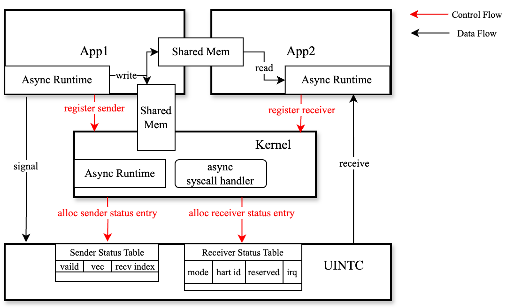
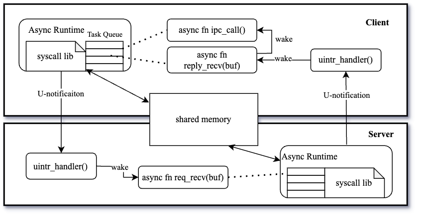
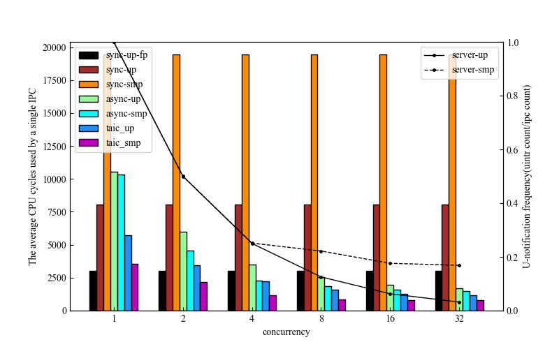
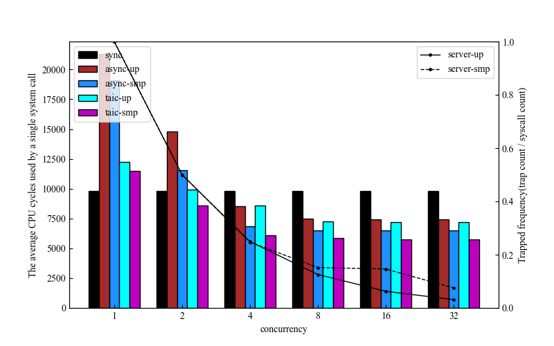

# 摘要

微内核在安全性、稳定性和模块化方面相比于宏内核有着极大的优势，随着微内核生态的发展，部分应用需要进行大量而频繁的系统调用和IPC，然而以seL4为代表的现代微内核支持的同步系统调用和IPC导致了大量的特权级切换，此外，由于同步调用的阻塞等待导致系统无法充分利用多核的性能，虽然微内核对异步通知有一定的支持，但仍需要内核进行转发，其中的特权级切换开销在某些平台和场景下将造成不可忽视的开销。

本文聚焦微内核的异步通信机制，基于用户态中断技术，通过兼容capability机制和异步通信接口来改造seL4的通知机制，设计了U-notification，使得通知无需通过内核转发，减少特权级切换的开销。同时利用U-notification，借助共享内存和异步编程机制，设计了无需陷入内核的异步系统调用和异步IPC框架，在提升用户态并发度的同时，减少特权级的切换次数。我们基于seL4在FPGA上实现了ReL4，将IPC性能最高提升了3x，在IPC频繁的系统中（网络服务器）将吞吐量提升了1x。

关键词：微内核；异步；用户态中断。

# 1. 引言

微内核相比宏内核具有显著优势[1]。它采用模块化设计，提高了系统的可靠性、灵活性和安全性，微内核更易于维护和升级，具有更强的可移植性和定制能力，其设计理念适合分布式系统，允许动态加载服务，便于调试，核心功能的分离减少了系统受攻击的风险。这些特性使微内核在需要高可靠性、安全性和适应性的环境中特别有价值。然而，自从微内核提出以来，最大的性能瓶颈就是进程间通信（IPC）[2]，30年前Liedtke提出的L4[3]通过对内核系统的重新设计，证明了微内核的IPC也可以很快，之后以seL4[4]为代表的现代微内核的IPC框架也基本延续了最初的L4，以同步IPC作为主要的通信方式，同时引入异步的通知机制来简化多线程程序设计，提升多核的利用率。

然而随着软硬件生态的发展，seL4中的IPC通信方式并不能很好的满足部分应用的性能要求。首先是软件对系统有了新的要求，随着软件复杂性的提升，系统级软件如数据库管理系统、网络服务器等，需要进行大量的系统调用和IPC[5]，这要求系统能够以快速高效的形式处理大量系统调用和IPC，而微内核将操作系统的大部分服务（如网络协议栈、文件系统等）移到用户态，从而使得IPC数量和频率激增，内核态与用户态之间的特权级切换成为性能瓶颈。此外，新出现的硬件漏洞如Meltdown[6]和 Spectre[7]漏洞促使 Linux 使用 KPTI[8] 补丁来分离用户程序和内核的页表，进一步增加了陷入内核的开销，seL4 中也有类似的机制。最后，外设速度越来越快，而现代微内核的外设驱动往往存在于用户态，外设中断被转化为通知信号，需要用户态驱动主动陷入内核来进行接收，这在一定程度上成为了外设驱动的性能瓶颈[9]。

综上所述，以seL4为代表的现代微内核在设计上有两点不足，导致了特权级切换成为系统的性能瓶颈：1）通知机制需要内核转发。2）系统调用和同步IPC需要频繁的出入内核。

在这篇文章中，我们提出ReL4，一个用Rust编写的基于用户态中断的高性能异步微内核，我们基于用户态中断技术设计了U-notificaiton，在兼容capability机制的基础上改造微内核的通知机制，并利用改造后的U-notification和共享内存设计和实现了一套绕过内核的异步IPC框架。从广义的角度来看，系统调用作为一种特殊的IPC形式，我们同样借助IPC框架对系统调用进行异步化改造，从而设计和实现了一个完全异步的微内核架构。

这里有一些挑战需要被注意到：
- 用户态中断虽然与通知机制的作用相似，但对于通信权限的控制如何与capability机制兼容，以及中断的抢占式行为与notification的主动询问的用法如何进行兼容，仍然需要我们进行仔细的设计。
- 用户态中断的开销小于特权级切换，但仍然对程序局部性和内存缓存不够友好，因此我们需要尽可能减少用户态中断的次数。
- 由于内核往往与用户态程序共用CPU核心，因此对于异步系统调用，在不破坏微内核已有的任务优先级机制前提下，内核如何快速高效地执行异步系统调用请求，从而尽可能地利用CPU资源值得我们深入思考。

为了评估我们的设计与实现，我们在ReL4上评估了不同负载下单次IPC的平均开销，同时在ReL4上搭建了一个TCP服务器和一个用户态内存分配器用于评估系统的整体性能。本文将从背景、系统设计、实现细节、性能评估四个方面介绍我们的工作。

# 2. 背景

现代微内核的大部分IPC优化始于Liedtke提出的L4，由于之前的微内核IPC存在性能瓶颈，L4从硬件优化、系统架构、软件接口的各个方面对IPC进行了重新设计。其中的优化角度可以简单划分为内核路径优化和上下文切换优化。

对于内核路径优化，L4通过物理消息寄存器来传递短消息，从而避免了内存拷贝，然而随着访存速度的加快，消息寄存器的零拷贝优化带来的收益逐渐减弱，使用物理寄存器导致的平台依赖和编译器优化失效反而限制了系统的性能[10]，因此物理的消息寄存器逐渐被现代微内核以虚拟消息寄存器代替；此外，L4使用临时映射的形式来进行长消息的传递，避免多余的内存拷贝，但却在内核中引入了缺页异常的可能性没增加了内核行为的复杂性[10]，现代微内核一般放弃了这个优化；针对常用且普遍的IPC场景，L4设计了专门的快速路径，避免了复杂繁琐的参数解析和任务调度，然而快速路径对消息长度、任务优先级有着严格的限制，也无法对多核心进行支持。

对于特权级的切换优化，L4使用的物理消息寄存器在一定程度上减少了上下文切换的开销，但其副作用超过了优化收益导致其被虚拟消息寄存器代替[10]；同时L4敏锐地观察到大部分IPC通信遵循C/S模型，因此通过组合系统调用的形式，将Send + Reply 组合为 Call，将Reply + Recv 组合成ReplyRecv，从而减少了特权级切换的频率，该优化至今作为现代微内核的重要优化手段，但仍然无法避免特权级的切换；此外，L4通过通过ASID机制，在快表项中维护地址空间标识符，减少快表冲刷的频率，缓解了快表污染的问题，然而依然无法避免特权级切换带来的快表污染和缓存失效。

总而言之，现代微内核在单核环境下的IPC内核路径上的优化已经较为完善，在最理想的情况下仅需要两次特权级切换，然而对多核环境下，由于需要核间中断，无法进入快速路径，导致多核下的IPC内核路径依旧冗长。而现代微内核在特权级切换的优化方面仍然停留在缓解开销的层面上，无法从根本上消除特权级的切换。

本文聚焦现代微内核架构设计中的特权级切换开销，旨在设计一种新型的IPC架构，使得减少甚至消除IPC和系统调用中的特权级切换，先前已经有大量的工作从软硬件的角度致力于减少特权级切换开销。

从硬件出发的角度，大多数工作通过设计特殊的硬件或者特殊的指令来实现内核实现IPC。如SkyBridge[11]允许进程在IPC中直接切换到目标进程的虚拟地址空间并调用目标函数，它通过精心设计一个虚拟化层（Root Kernel）提供虚拟化的功能，通过VMFUNC地址空间的直接切换，并通过其他一系列软件手段来保证安全性，但这种方案仅适用于虚拟化环境中。XPC[12]则直接使用硬件来提供一个无需经过内核的同步功能调用，并提供一种新的空间映射机制用于调用者与被调用者之间的零拷贝消息传递，然而该方案没有相应的硬件标准，也没有一款通用的处理器对其进行支持。这些方法都基于特殊的环境或者没有标准化的硬件来实现，适用范围有限

从软件出发的角度，相关工作主要分为两类：第一类方法通过将用户态和内核态的功能扁平化来减少内核与用户态的切换开销，如unikernel[13, 14, 15]将所有用户态代码都映射到内核态执行，Userspace Bypass[16]通过动态二进制分析将两个系统调用之间的用户态代码移入内核态执行，从而减少陷入内核的次数，kernel bypass[17, 18]则通过将硬件驱动（传统内核的功能）移入用户态，从而减少上下文的切换。这些方法要么需要特殊的硬件支持，要么难以与微内核的设计理念兼容，因此都只能提供一定的参考价值。第二类方法则是允许用户空间对多个系统调用请求排队，并仅通过一个系统调用来将他们注册给内核。如FlexSC[19]通过在用户态设计一个用户态线程的运行时，将用户态线程发起的系统调用自动收集，然后陷入内核态进行批量执行。该方法虽然可以有效的减少陷入内核的次数，但如何设置提交的时机难以把握，过短的提交间隔将导致切换次数增加，过长的提交间隔则会导致空闲的CPU空转。

虽然现有工作难以广泛且有效地应用到微内核中，但他们的思路值得我们借鉴，他们的缺陷驱使我们去寻求更好的方案。在硬件方面，一种新型的硬件技术方案——用户态中断[20, 21]逐渐被各个硬件平台（x86，RISC-V）采纳，它通过在CPU中新增中断代理机制和用户态中断的状态寄存器，当中断代理机制检测到状态寄存器发生变化时，会将中断以硬件转发的形式传递给用户态程序，从而绕过内核。该硬件方案已经在Sapphire Rapids x86处理器上和RISCV的N扩展中有了一定的支持，适用范围更加广泛。而在软件方面，异步被广泛用于请求合并和开销均摊，传统类Unix系统提供的类似select IO多路复用接口相对简陋，迫使用户态代码采用事件分发的编程范式来处理异步事件，代码相对复杂，可读性较弱。而新兴的Rust[22, 23]语言对异步有着良好的支持，其零成本抽象的设计也让它作为系统编程语言有着强大的竞争力。使用Rust进行内核和用户态基础库的开发，可以更好地对异步接口进行抽象，改善接口的易用性和代码的可读性。

基于上述背景，本文将利用用户态中断机制改造微内核的异步通知机制，并借助Rust语言提供的协程机制和共享内存，在微内核上设计一套异步IPC方案，减少甚至避免特权级的切换。

<table>
    <tr>
        <th>优化方法</th><th>详细分类</th></th><th>实例</th><th>缺点</th>
    </tr>
    <tr>
        <td rowspan="3">减少内核路径</td><td>临时地址映射 </td><td rowspan="1"> [3] </td> <td rowspan="3"> 上下文切换开销已经成为性能瓶颈 </td>
    </tr> 
    <tr>
        <td>快速路径</td><td rowspan="2"> [3, 4, 24, 25, 26]
    </tr>
    <tr>
        <td>消息寄存器</td>
    </tr>
    <tr>
        <td rowspan="5">减少上下文切换开销 </td> <td> 消息寄存器 </td>  <td rowspan="2"> [3, 4, 24, 25, 26] </td> <td rowspan="3"> 无法从根本上消除切换开销 </td>
    </tr>
    <tr>
        <td>组合系统调用</td>
    </tr>
    <tr>
        <td>ASID机制</td> <td> [4] </td>
    </tr>
    <tr>
        <td>统一地址空间</td> <td> [13, 14, 15, 16, 17, 18] </td>  <td rowspan="2"> 与微内核设计理念相悖，无法有效地实施到微内核中 </td>
    </tr>
    <tr>
        <td>批量系统调用</td> <td> [19] </td> 
    </tr>
        <tr>
        <td rowspan="3">硬件优化</td><td> 虚拟化指令 </td><td rowspan="1"> [11] </td> <td rowspan="1"> 仅适用于虚拟化环境 </td>
    </tr> 
    <tr>
        <td rowspan="2"> 直接硬件辅助 </td><td rowspan="1"> [12] </td> <td rowspan="1"> 没有硬件标准，没有通用硬件的支持 </td>
    </tr> 
    <tr>
	        <td rowspan="1"> 用户态中断 </td> <td rowspan="1"> --- </td>
    </tr> 
</table>

# 3. 设计与实现

基于上述背景，我们利用用户态中断技术，通过兼容capability机制和异步通信接口来改造微内核的通知机制（U-notification）。同时利用U-notifcation，借助共享内存和编程语言对异步编程的支持，设计了无需陷入内核的异步系统调用和异步IPC框架，在提升用户态并发度的同时，减少用户态和内核态的切换次数，最终提升系统的整体性能。详细设计主要分为三个部分：
- U-notification：U-notification所需的硬件资源由内核管理，内核将UINTC的硬件资源索引集成到notification对象中，以兼容原始的通知机制。用户态程序通过系统调用来申请和释放硬件资源。
- 共享内存：由于通知机制的传递数据量有限（仅1 bit），我们仅将其作为同步的方式，收发双方通过共享内存的形式进行数据通信。
- 异步运行时：为了更好地使用异步IPC，我们设计了异步运行时。主要分为用户态和内核态：
	- 用户态的异步运行时代理了硬件资源的申请和释放，同时还维护了能力具柄（capability）到硬件索引的映射，以实现通知机制的兼容性。此外，异步运行时还代理了所有的系统调用请求，根据系统调用的类型将其转化为同步或者异步。最后，运行时中包含一个优先级调度器用于调用协程任务，提升用户态的并发度。
	- 内核态的异步运行时包含了异步系统调用的处理协程，以及一个优先级调度器用于调度执行这些协程。


下面是我们的设计目标：
- 利用用户态中断改造微内核的通知机制，在减少特权级的切换次数，提升系统性能的同时尽可能兼容原始的通信接口，保证易用性。
- 利用共享内存和Rust语言协程机制自动收集IPC请求和系统调用请求并进行异步处理，提升系统并发性。
- 根据系统负载来动态选择通知内核/接收进程的时机，充分利用CPU资源。

## 3.1 U-notification

原始的微内核中的通知机制在内核中维护一个特殊的内核对象(notification)，保存相关的通知状态位，以状态机的形式工作，同时将具有不同通信权限的能力句柄暴露给不同的线程。持有能力句柄的线程可以根据句柄的权限来进行相应的操作。从图中可以看出，在原始的通知机制中，通信的权限控制流图是一个冗余的连通图，只要拥有合适的capability，所有的Sender TCB可以通过任意一个notificaiton对象向任意一个Receiver TCB发送通知，反之也成立。然而原始的通知机制的数据流和控制流均需要流经内核，造成大量的特权级切换。


用户态中断使得控制流和数据流相互分离。我们在原本的notification内核对象中维护了对应的硬件资源索引，控制流主要由用户态向内核进行注册，申请硬件资源，数据流则通过特殊的用户态指令访问用户态中断控制器来进行通信，从而在通信过程中避免了特权级的切换。
- 控制流：控制流主要分为发送方的注册和接收方的注册
	- 接收方注册：用户态通过Untyped_Retype申请一个Notification对象之后，调用TCB_Bind接口进行硬件资源绑定，运行时进一步调用UintrRegisterReceiver系统调用，将运行时中定义的用户态中断向量表注册到TCB中，申请UINTC的接收状态表项，并绑定到Notification对象及其对应的线程上。
	- 发送方注册：发送方通过能力派生的形式获取指向Notification对象的Capability，第一次调用Send操作时，运行时会判断Cap是否有对应的Sender ID，如果没有，则调用UintrRegisterSender系统调用进行发送端注册，并填充对应的SenderID。
- 数据流：发送端在注册完成之后，会直接调用uipi_send指令，指令根据Sender Status Table Entry中的索引设置中断控制器中的寄存器。如果接收端本身在线，会立刻被中断并跳转到注册的中断向量表，如果不在线，则会等到被内核重新调度时再进行处理。

U-notification相比于原始的通知机制在通信权限控制方面有一些不同，主要是以下两点：
- 原始的通知机制允许多个接收线程竞争接收一个内核对象上的通知，这种设计的目的是为了支持多接收端的场景，事实上，多接收端已经通过多个内核对象来进行支持，因此这种机制相对冗余，而由于U-notification中接收端对接收线程的独占性，这个能力将不再被支持。
- 原始的通知机制允许单个接收线程接收多个内核对象上的通知，这种设计的目的是更灵活地支持多发送端的场景，在U-notification中，同一个内核对象可以被设置为相同的recv status idx，不同的发送端则通过使用中断号（uintr vec）来进行区分，

除了权限控制有所不同之外，改造前后的通信方式也有所区别。原始的通知机制需要用户态通过系统调用主动询问内核是否有通知需要处理。根据是否要将线程阻塞，一般被设计为Wait和Poll两个接口。而U-notification无需接收线程主动陷入并询问内核，接收线程随时被硬件发起的用户态中断打断，并处理到来的通知，这在很大程度上解放了接收线程，程序设计者无需关心通知到来的时机，减少了CPU忙等的几率，提升了接收线程的并发度。而为了提升U-notification的易用性，我们需要对原始的通信接口进行兼容：
- Poll：无需陷入内核态，在用户态读取中断状态寄存器，判断是否有效并返回。
- Wait：对该接口的兼容需要用户态的异步运行时（将在3.2节详细介绍），在没有有效中断时，该操作将阻塞当前协程并切换到其他协程执行，等待用户态中断唤醒。

## 3.2 异步IPC

U-notification作为异步通知机制，其传输的数据长度十分有限（仅为1bit），为了更好地支持IPC，我们借助共享内存在用户态构建以U-notification为基础的异步IPC框架。其核心主要分为四点：

- 共享内存：请求数据和响应数据的传递载体。
- 协程：分为ipc协程和recv协程，用户态的IPC任务将被封装在ipc协程中，来实现更好的并发性；recv协程用于读取共享内存的数据，并唤醒相关处理协程。
- 调度器：根据优先级调度任务队列中的所有协程。
- U-notification：用于唤醒对端的recv协程。


一个典型的异步IPC流程如下：
- 客户端通过ipc协程将请求写入共享内存后，并根据服务端的recv协程的在线状态发送U-notification，而后被调度器阻塞并切换去执行其他ipc协程或recv协程。
- 服务端收到U-notification之后将recv协程唤醒，由本地调度器调度运行，recv协程不断读取共享内存中的请求，处理后将响应写入共享内存，并根据客户端的recv协程的在线状态发送U-notification。当共享内存中没有其他请求或recv协程运行时间过长时，会被调度器切换到其他可运行协程中。
- 客户端收到U-notification后将recv协程唤醒，recv协程不断读取共享内存中的响应并将之前被阻塞的ipc协程唤醒。
下面将从共享内存、异步运行时和优先级调度三个方面来详细介绍我们的设计。
### 3.2.1 共享内存

由于U-notification一次只能传递 1 比特的数据，因此我们依然需要共享内存来作为IPC数据传递的主要形式，我们以IPC中最常见的Call为例，客户端需要将请求数据准备好并写入共享内存中，而服务端将在某个时刻从共享内存中读取请求，处理后将响应写回共享内存，而客户端也将在之后的某一时刻从共享内存中读取响应并进行相应处理。这个流程中有几个挑战需要我们明确：
- 请求和响应的格式和长度如何设计才能使得内存访问效率更高。
- 在共享内存中如何组织请求和响应的存取形式，才能在数据安全读写的前提下保证性能。
- 客户端和服务端如何选择合适的时机来接收数据。


如上图所示，我们将一个IPC消息（请求或响应）定义为 `IPCItem`，它是IPC传递消息的基本单元，为了减少消息读写以及编解码的成本，我们采用定长的消息字段。每个IPCItem的长度被定义为缓存行的整数倍并对齐，消息中的前四个字节用于存储提交该消息的协程id，方便后续通过响应进行唤醒。`msg info` 用于存储消息的元数据，包含了消息类型、长度等。 `extend msg` 将被具体的应用程序根据不同的用户进行定义。

由于共享内存会被一个以上的线程同时访问，因此我们需要设计同步互斥操作来保证数据的读写安全。共享内存的访问极为频繁，因此我们要尽可能避免数据竞争来保证读写性能。我们将请求和响应放到不同的环形缓冲区中，同时不同的发送方和接收方使用不同的环形缓冲区以保证单生产者单消费者的约束，消除过多的数据竞争，最后，我们使用无锁的方式[27]进一步提升环形缓冲区的读写性能。

数据被写入环形缓冲区之后，对端何时读取需要我们权衡。一种方式是对端不断地轮询缓冲区是否有数据，但这无疑会浪费CPU资源，并加剧缓冲区的数据竞争，另一种方式写入数据后通过U-notification通知对端读取数据，但我们无法得知对端是否正在读取数据，只能盲目发送，这在很大程度上造成了中断资源的浪费，也导致了对端的执行流被频繁打断，因此我们在缓冲区中维护了对端的recv协程的在线情况，并以此为依据判断是否需要发送U-notification。

### 3.2.2 异步运行时

传统微内核中的同步IPC会导致发送端线程阻塞，从而造成一些没有依赖的IPC被迫以顺序的形式执行，或者强制要求多线程来实现并发。因此我们为每个进程在用户态实现了一个异步运行时，提供了协程作为任务的执行单元，用于提升用户态并发度。用户态的IPC任务都将被封装为ipc协程，由运行时内的调度器进行调度。除了ipc协程，运行时中还存在recv协程，用于读取共享内存中的数据。值得注意的是，异步运行时只会调度当前进程中的异步任务。为了实现异步IPC，我们除了要依赖异步运行时进行调度、阻塞和唤醒之外，还需要U-notification将不同进程的异步运行时联系起来，完成异步IPC框架的控制流回路。

我们仍然以IPC中最常见的Call为例，客户端进程和服务端进程在双方建立连接时都会注册一个接收协程用于不断从缓冲区的环形缓冲区中读取数据并进行处理。我们分别对服务端和客户端的recv协程提供了两个默认实现，对于特殊的需求，用户程序可以通过运行时接口自定义recv协程的行为：
- 服务端：读取请求并处理后将响应写入环形缓冲区，并根据标志位判断是否发送U-notification，没有请求时阻塞切换。
- 客户端：读取响应并唤醒响应的协程，没有响应时阻塞切换。

控制回路将分为以下三个阶段，客户端和服务端的伪代码如下：
- 客户端发起请求：用户态程序将以协程的形式发起IPC请求，异步运行时首先会根据请求的数据和协程的协程号生成`IPCItem` 并写入请求的环形缓冲区中并将当前协程阻塞，然后检查缓冲区的 `req_co_status` 标志位，如果对方的recv协程在线，那我们无需通知对方进程，对方进程的异步运行时会在某个时刻调度到该协程并读取请求进行处理。如果对方的recv协程不在线，则异步运行时会发送U-notification通知对方进程唤醒recv协程并重启调度。
- 服务端处理请求并写回响应：服务端的recv协程会在合适的时机读取出请求并进行解码和处理，然后根据处理结果构造响应的 `IPCItem` 并写入响应的环形缓冲区中，检查缓冲区中的 `reply_co_status` 标志位，如果客户端的响应recv协程在线，则无需发起通知，否则需要发起U-notification通知客户端进程唤醒recv协程并重启调度。
- 客户端处理响应：客户端的recv协程会在合适的时机读取响应并唤醒之前阻塞的协程，然后重启调度。
```rust

// client
async ipc_call(cap, msg_info) -> Result<IPCItem, ()> {
	item = IPCItem::new(current_cid(), msg_info);
	buffer = get_buffer_from_cap(cap);
	buffer.req_ring_buffer.write(item);
	if buffer.req_co_status == false {
		buffer.req_co_status = true;
		u_notification_signal(cap);
	}
	if let Some(reply) = yield_now.await() {
		return Some(reply);
	}
	return Err(());
}

// server
async ipc_recv_reply(cap) {
	buffer = get_buffer_from_cap(cap);
	loop {
		if let Some(item) = buffer.req_items.get_first_item() {
			reply = hanlde_item(item);
			buffer.resp_ring_buffer.write(reply);
			if buffer.reply_co_status == false {
				buffer.reply_co_status = true;
				u_notification_signal(cap);
			}
		} else {
			buffer.req_co_status = false;
			yield_now.await();
		}
	}
}
```
从例子中我们可以看出，异步运行时给用户态程序提供了一个异步的运行环境，而U-notification则将不同的进程联系起来，成为完成整个异步IPC的控制回路中的关键一步。

### 3.2.3 优先级调度

从调度器的角度来看，系统中主要分为了两类协程：ipc协程和recv协程，这两类协程存在着一定的依赖关系。以客户端为例，ipc协程用于发起ipc请求，recv协程则是处理响应。从高吞吐率的角度来讲，自然是希望更快的处理ipc协程，而从低延迟的角度来讲则是希望优先调度recv协程，高吞吐和低延迟的特性由上层业务决定，框架层只根据业务配置进行支持。此外，不同的ipc任务也需要有轻重缓急之分，以便更有效率地利用CPU资源。

基于上述原因，我们在调度器中设计了优先级队列，每个协程都被设有相应的优先级，调度器在内部维护了一个优先级位图和若干任务队列，调度器将根据优先级位图选出最高的优先级，找到对应的任务队列并以先进先出的形式选出任务来运行。用户态程序根据业务特点设置相关的优先级，以达到性能调优的目的。

## 3.3 异步系统调用

虽然现代微内核的大部分系统调用都十分简短，并且在将同步IPC从内核中移除之后，系统调用将不再阻塞任何线程，但对于某些系统级组件（如内存分配器）而言，频繁而大量的系统调用导致的特权级切换开销依旧无法忽视。此外，从广义上看，系统调用属于一种特殊的IPC，即内核作为一个特殊的服务端，与各个应用程序客户端进行通信。以seL4为代表的现代微内核大多将内核实现为互斥访问[28]，即每次只有一个CPU核心能够进入内核，对于共享内存的访问符合单生产者单消费者的抽象，因此从异步IPC扩展到异步系统调用来减少特权级切换是一件极具性价比的事情。

我们在内核中设计了一套相似的异步运行时以支持异步系统调用，并在用户态的异步运行时中提供一套重新实现的系统调用库，以相同的函数接口替换同步系统调用。异步系统调用库会将系统调用参数和当前的用户协程号封装为一个IPCItem并写入请求的环形缓冲区中，然后根据内核中recv协程的在线状态来判断是否需要陷入到内核中去唤醒该协程。当前核心只需要在内核返回响应之前等待或执行其他用户态协程即可。

需要注意的是，有两类系统调用无法转化为异步系统调用：1）由于异步系统调用依赖于异步运行时，因此与异步运行时初始化相关的系统调用无法被异步化。2）对于实时性要求较高的系统调用无法进行异步化，如get_clock()。异步运行时会根据系统调用的种类来选择合适的处理方式。


异步系统调用与异步IPC的主要不同之处有两点：
- 由于接收端是内核，发送端无法使用U-notificaiton去通知内核。
- 异步IPC中进程的异步调度器就是进程的执行主体，无需考虑异步任务的执行时机，而内核除了异步系统调用请求需要调度器执行，本身就有如中断、异常、任务调度等其他任务需要被执行。

对于第一点，我们只需要新增一个系统调用去用于唤醒相关的内核协程即可。而对于第二点，一个很容易想到的异步任务执行时机是每次时钟中断到来时，然而这可能会导致空闲的CPU核心无法及时触发时钟中断而空转，因此，在不破坏原本的线程优先级调度前提下，我们使用核间中断来抢占空闲核心或正在运行低优先级线程的核心，更好地利用空闲CPU资源，减少响应时延。

为了避免破坏微内核中原本的优先级调度机制，我们在内核中对每个核心维护了相应的执行优先级(exec_prio)，执行优先级区别于上文提到的运行时协程优先级，是由内核调度器维护的线程优先级。内核中的任务主要分为三类：
- idle_thread: 空闲核心执行idle线程，此时核心的执行优先级为256，属于最低的执行优先级。
- 内核态：正在处理中断、异常、系统调用等，此时核心的执行优先级为0，最高优先级，不可被抢占。
- 用户态任务：正在执行用户态的任务，此时核心的执行优先级为当前线程的优先级，可以被更高优先级线程提交的异步系统调用请求打断。

当发送端通过系统调用陷入内核去唤醒相应协程后，会检查当前线程的优先级是否可以抢占其他核心，如果可以，则发送核间中断抢占该核心去执行异步系统调用，当前核心则返回用户态继续执行其他协程。如果没有可以被抢占的核心，则在下一次时钟中断到来时执行异步系统调用请求，其伪代码如下。
```rust
fn wake_syscall_handler() {
	if let Some(cid) = get_current_thread().async_sys_handler_cid {
		coroutine_wake(cid);
		current_exec_prio = get_currenct_thread().tcb_priority;
		idx, exec_prio = find_max_exec_prio(CPU_PRIO);
		if (current_exec_prio < exec_prio) {
			let mask = 1 << cpu_id;
			ipi_send_mask(mask, ASYNC_SYSCALL_HANDLE, mask);
		}
	}
}
```

值得注意的是，异步系统调用的处理可能是一个十分耗时的过程（如果有足够多的系统调用请求），而seL4在内核态处于屏蔽中断的状态，这在一定程度上影响了微内核的实时性，因此我们在每个请求处理完成后插入抢占点，如果有中断到来，则在处理中断后重启异步系统调用处理流程。
# 4. 实现

为了简洁高效地实现异步微内核的原型系统，我们使用Rust语言在RISC-V平台上实现了一个兼容seL4的微内核ReL4，目前已经支持SMP架构和fastpath优化。在兼容seL4原始功能的基础（包括SMP和fastpath优化）上，我们在ReL4实现了U-notificaiton以及异步IPC和异步系统调用。在实现过程中对内核接口更改和使用的一些重要优化手段将在本章描述。

## 4.1 新增系统调用

为了支持内核对U-notification的资源管理，我们新增了系统调用：`UintrRegisterSender` 和 `UintrRegisterReceiver` 用于申请相关的硬件资源。此外，为了支持异步系统调用，我们也需要将共享内存注册给内核（`UintrRegisterAsyncSyscall`)，并提供一个用于唤醒系统调用处理协程的系统调用`UintrWakeSyscallHandler`。这些系统调用均由异步运行时代理调用，用户程序无需感知。

| Syscall                   | Args                 | Details                                        |
| ------------------------- | -------------------- | ---------------------------------------------- |
| UintrRegisterSender       | ntfn_cap             | 注册发送端，传入U-notification对象的能力句柄                  |
| UintrRegisterReceiver     | ntfn_cap             | 注册接收端，传入U-notification对象的能力句柄                  |
| UintrRegisterAsyncSyscall | ntfn_cap, buffer_cap | 注册异步系统调用的处理协程，传入响应U-notifcaiton的能力句柄和共享内存的能力句柄 |
| UintrWakeSyscallHandler   | \                    | 唤醒内核中当前线程对应的异步系统调用处理协程                         |
## 4.2 自适应的混合轮询

虽然用户态中断的开销小于特权级切换，但仍然对程序局部性和内存缓存不够友好，而轮询虽然可以避免用户态中断，但却会导致CPU资源的浪费，因此我们实现了共享内存中设置了recv协程的状态标志位，用于判断是否需要发送用户态中断来对原本轮询的recv协程进行唤醒。当请求频率足够高或服务端负载足够大时，recv协程始终处于在线状态，无需发送用户态中断，工作方式等价于轮询模式。当请求频率较低时，recv协程在大部分时间处于阻塞状态，节省CPU资源，工作方式等价于中断模式。

此外，我们在提供recv协程的默认实现之外，还提供了用户自定义的接口。对于比较耗时的请求，用户可以通过自定义接口将请求分发给其他协程，从而实现更好的并发性。

# 5. 评估

为了评估ReL4的兼容性，我们在ReL4上成功运行了seL4test[29]并通过了相关的测试用例，而为了评估异步IPC和异步系统调用的效率，我们在ReL4上对比了不同负载下异步IPC和同步IPC的性能，最后构建了一个高并发的TCP Server和内存分配器用于评估异步IPC和异步系统调用在真实应用中的表现。总的实验环境配置参数如下表所示。

<table >
    <tr>
        <td rowspan="3">FPGA</td><td colspan="2">Zynq UltraScale + XCZU15EG-2FFVB1156 MPSoC[31] </td>
    </tr> 
    <tr>
        <td>RISC-V  soft IP core</td><td> rocket-chip[30] with N  extension, 4 Core, 100MHz</td>
    </tr>
    <tr>
        <td>Ethernet  IP core</td> <td>Xilinx AXI 1G/2.5G  Ethernet Subsystem (1Gbps)[32] </td>
    </tr>
    <tr>
        <td rowspan="1">Operating  System </td> <td colspan="2"> ReL4 </td> 
    </tr>
    <tr>
        <td>Network  Stack</td> <td colspan="2"> smoltcp[33] </td> 
    </tr>
</table>

## 5.1 同步IPC vs. 异步IPC

为了从微观角度评估我们设计的异步IPC性能，我们测量了不同并发量和不同服务端负载下异步IPC和同步IPC的平均开销。由于我们关注的是同步IPC和异步IPC的路径差异，需要保证场景没有过多干扰，因此我们分别构建了一个服务端进程和一个客户端进程进行乒乓测试，测试结果如下图所示。



左图横坐标为客户端的并发量，其中sync-up-fp代表同步IPC在开启fastpath优化且在单核情况下（客户端和服务端在同一个核心）所使用的CPU周期数，其他以此类推。
- 同步IPC：由于同步IPC会阻塞整个线程，因此并发量对同步IPC并没有意义。而在多核环境下，fastpath检查会失败，所有的同步IPC都会在内核中通过核间中断进行传递，因此多核环境下的同步IPC性能很低；而对于单核下的同步IPC，fastpath会避开复杂的消息解码和冗长的调度流程，因此开启fastpath的IPC性能会提升167%，但我们需要注意的是，fastpath对于线程优先级、消息长度等有着严苛的检查流程，因此在实际应用场景中fastpath优化并不总能生效。
- 异步IPC：异步IPC的开销随着并发量的提升而降低，这是由于随着并发量的增加，服务端的负载进一步增加，而U-notification的通知时机采用自适应的形式，因此通知频率下降，导致了均摊到每个IPC的开销下降。我们还可以看出，在并发度较小的时候，多核会略快于单核（最高提升52%），符合预期，随着并发度的逐渐增加，多核与单核的性能差异逐渐缩小（17%），这是由于多核情况下服务端单独使用一个核心，导致服务端负载过小，产生了更加频繁的用户态中断（如左图中的蓝色折线），导致服务端吞吐量过小，又反过来限制了客户端的请求频率。可以从第二幅图中看出，当我们增加服务端负载时，服务端的中断频率会逐渐下降，直至归0，这是自适应轮询带来的优势。
- 对比同步IPC和异步IPC：当并发度为1的时候，每个异步IPC的开销都包含了两次用户态中断的开销、调度器的运行时开销，而同步IPC则是两次特权级切换的开销，如果没有fastpath优化，还会有内核路径中的解码开销和调度开销，因此在低并发度的场景下异步IPC的略性能会低于没有fastpath优化的同步IPC（31%），同时显著低于有fastpath优化的同步IPC（249%）。而当并发量较大时，用户态中断的频率减少，均摊到每一次IPC下，用户态中断的开销几乎可以忽略不计，因此异步IPC的开销主要是调度器的运行时开销，而此时的异步IPC性能会显著高于没有fastpath优化的同步IPC（369%），也高于有fastpath优化的同步IPC（76%）。
- 从上面我们可以得出结论：在多核场景下，我们的异步IPC相比于同步始终有着良好的表现。而在单核且低并发度场景下，异步IPC性能会比较差，但随着并发度增加，异步IPC的性能会迅速提升，在并发度为2时就已经超过没有fastpath优化的同步IPC，在并发度为8时就已经超过了开启fastpath优化的同步IPC，因此异步IPC依然十分有竞争力。

## 5.2 TCP Server

模拟的Web服务器应用场景由三部分组成，一部分是运行在PC上的客户端，在启动时与运行在FPGA上的TCP Server建立若干个连接，并不断地向服务端发送64字节（小包）的数据，并接收服务器的响应；第二部分是FPGA中的网络协议栈（NW Stack Server），集成了网卡驱动的代码，通过smoltcp协议栈维护每个连接的状态信息，负责从网卡中接收数据并进行协议处理后通过共享内存返回给TCP Server，以及从TCP Server接收数据并通过网卡发出；第三部分是TCP Server，通过NW Stack Server接收客户端发送过来的请求，在处理完成之后返回响应后通过NW Stack Server发送给客户端。最后，PC 上的客户端计算发送每个请求和接收响应之间的时间延迟，并计算固定时间段内的消息吞吐量。我们通过分析不同配置下 TCP Server 的时间延迟和吞吐量来评估 ReL4。


- 从总体趋势上看，吞吐量随着并发度的增加呈现先增加后减少的趋势，而时延成整体上升的趋势。在低并发度条件下的系统负载没有打满，随着并发度增加，吞吐量能稳步提升，随着系统负载打满之后，继续增加并发度，会导致网络中断频率上升，从而限制系统的整体性能，吞吐量减少。
- 同步和异步对比来看，可以看出当连接数较低，并发度较小的情况下，异步IPC实现的TCP Server无论是在吞吐率还是平均时延上都要优于同步IPC，这是由于同步IPC需要频繁陷入内核，而内核态屏蔽了网络中断，导致网络包无法及时处理。而随着并发度的增加，由于同步IPC实现的TCP Server需要多线程来保证多连接，因此线程切换的开销急剧加大，导致同步和异步的差距进一步增加。在连接数为4的时候差距达到最大，为192%，在并发度最大的情况下，异步IPC实现的TCP Server也比同步IPC高出120%。
- 单核与多核对比来看，异步IPC实现的TCP Server随着CPU资源增加，吞吐量提升，时延降低，而对于同步IPC实现的TCP Server情况则有所不同，由于同步IPC在多核下采用的IPI的形式在内核进行转发，导致程序的内存局部性和代码局部性都不够友好，因此多核的性能变现会略低于单核。
## 5.3 内存分配器

为了验证异步系统调用对于系统性能的影响，我们在用户态设计了一个用于内存分配的服务器，该服务器线程通过消息队列不断接收其他线程发送的内存分配/释放请求，从而调用响应的map/unmap系统调用。我们用同步和异步的方式分别实现了它对系统调用的处理，结果如下：



- 从总体趋势上看，异步实现的内存分配器的性能随着并发度的提高，性能呈稳步上升的趋势，在并发度为64之后趋于稳定，这是并发度提升带来的内核陷入频率降低，特权级切换开销下降，导致了性能的提升。
- 同步和异步的对比来看，当并发度小于32时，同步系统调用的性能仍然高于异步系统调用，这是由于异步系统调用除了陷入内核的开销之外，还有运行时的开销以及U-notification的开销，因此在并发度较低时，减少的特权级切换开销少于增加的额外开销，因此异步系统调用性能较低。当并发度高于32后，特权级的切换开销急剧下降，因此异步的系统调用性能超过了同步IPC，与异步IPC相似，当内核负载增加时，客户端陷入内核的频率也会逐渐下降，直至降为0。
- 单核与多核对比来看，当内核与客户端不在同一个CPU核心上时，系统调用请求与处理将并行处理，因此性能会比单核高，但由于此时内核独占一个核心，因此内核的负载较小，客户端陷入内核的频率会略高于单核。

# 6. 总结
本文利用用户态中断机制在微内核中设计了一套无需陷入内核的异步IPC框架，并基于异步IPC框架对系统调用也进行了异步化改造，从而设计出一个完全异步的高性能微内核，经测试，异步IPC将IPC的性能提升了3x，在IPC频繁的系统中（如网络服务器）将系统性能最高提升1x。

本文提出的异步IPC和异步系统调用主要是为了提升高频度、上下文无关的IPC和系统调用请求的整体处理性能，因此在并发度高的系统中拥有卓越的表现，此外，在并发度低的情况下，我们仍然通过用户态中断这种开销相对较小的方式来取代特权级切换，从而在一定程度上弥补了低并发度情况下引入异步运行时带来的额外开销。

然而我们仍然可以看出，在并发度较低的场景下，我们的运行时开销仍然会导致性能略低于同步，在未来，我们期望用硬件实现异步运行时中的频繁操作（如fetch、wake等），从而尽可能消除运行时对性能的影响，在低并发度的情况下也能取得良好的性能。


## 7. 参考文献

[1] Roch B. Monolithic kernel vs. Microkernel[J]. TU Wien, 2004, 1.
[2] Liedtke J. Toward real microkernels[J]. Communications of the ACM, 1996, 39(9): 70-77.
[3] Liedtke J. Improving IPC by kernel design[C]//Proceedings of the fourteenth ACM symposium on Operating systems principles. 1993: 175-188.
[4] Klein G, Elphinstone K, Heiser G, et al. seL4: Formal verification of an OS kernel[C]//Proceedings of the ACM SIGOPS 22nd symposium on Operating systems principles. 2009: 207-220.
[5] Jeff Caruso. 1 million IOPS demonstrated. https://www.networkworld.com/article/2244085/1-million- iops-demonstrated.html. Accessed: 2021-12-01.
[6] Lipp M, Schwarz M, Gruss D, et al. Meltdown[J]. arXiv preprint arXiv:1801.01207, 2018.
[7] Kocher P, Horn J, Fogh A, et al. Spectre attacks: Exploiting speculative execution[J]. Communications of the ACM, 2020, 63(7): 93-101
[8] The kernel development community. Page table isolation (PTI). https://www.kernel.org/doc/html/latest/x86/pti.html. Accessed: 2021-12-01
[9] Blackham B, Shi Y, Heiser G. Improving interrupt response time in a verifiable protected microkernel[C]//Proceedings of the 7th ACM european conference on Computer Systems. 2012: 323-336.
[10] Heiser G, Elphinstone K. L4 microkernels: The lessons from 20 years of research and deployment[J]. ACM Transactions on Computer Systems (TOCS), 2016, 34(1): 1-29
[11] Mi Z, Li D, Yang Z, et al. Skybridge: Fast and secure inter-process communication for microkernels[C]//Proceedings of the Fourteenth EuroSys Conference 2019. 2019: 1-15.
[12] Du D, Hua Z, Xia Y, et al. XPC: architectural support for secure and efficient cross process call[C]//Proceedings of the 46th International Symposium on Computer Architecture. 2019: 671-684.
[13] Kuo H C, Williams D, Koller R, et al. A linux in unikernel clothing[C]//Proceedings of the Fifteenth European Conference on Computer Systems. 2020: 1-15
[14] Olivier P, Chiba D, Lankes S, et al. A binary-compatible unikernel[C]//Proceedings of the 15th ACM SIGPLAN/SIGOPS International Conference on Virtual Execution Environments. 2019: 59-73.
[15] Yu K, Zhang C, Zhao Y. Web Service Appliance Based on Unikernel[C]//2017 IEEE 37th International Conference on Distributed Computing Systems Workshops (ICDCSW). IEEE, 2017: 280-282.
[16] Zhou Z, Bi Y, Wan J, et al. Userspace Bypass: Accelerating Syscall-intensive Applications[C]//17th USENIX Symposium on Operating Systems Design and Implementation (OSDI 23). 2023: 33-49.
[17] Jeong E Y, Wood S, Jamshed M, et al. {mTCP}: a Highly Scalable User-level {TCP} Stack for Multicore Systems[C]//11th USENIX Symposium on Networked Systems Design and Implementation (NSDI 14). 2014:489-502.
[18] Yang Z, Harris J R, Walker B, et al. SPDK: A development kit to build high performance storage applications[C]//2017 IEEE International Conference on Cloud Computing Technology and Science (CloudCom). IEEE, 2017: 154-161.
[19] Soares L, Stumm M. {FlexSC}: Flexible system call scheduling with {Exception-Less} system calls[C]//9th USENIX Symposium on Operating Systems Design and Implementation (OSDI 10). 2010.
[20] Nassif N, Munch A O, Molnar C L, et al. Sapphire rapids: The next-generation Intel Xeon scalable processor[C]//2022 IEEE International Solid-State Circuits Conference (ISSCC). IEEE, 2022, 65: 44-46.
[21] Waterman A, Asanovic K. The RISC-V instruction set manual, volume II: Privileged architecture[J]. RISC-V Foundation, 2019: 1-4.
[22] Levy A, Andersen M P, Campbell B, et al. Ownership is theft: Experiences building an embedded OS in Rust[C]//Proceedings of the 8th Workshop on Programming Languages and Operating Systems. 2015: 21-26.
[23] Balasubramanian A, Baranowski M S, Burtsev A, et al. System programming in rust: Beyond safety[C]//Proceedings of the 16th workshop on hot topics in operating systems. 2017: 156-161.
[24] van Schaik C, Leslie B, Dannowski U, et al. NICTA L4-embedded kernel reference manual, version NICTA N1[R]. Technical report, National ICT Australia, October 2005. Latest version available from: http://www.ertos. nicta. com. au/research/l4.
[25]  Heiser G, Leslie B. The OKL4 Microvisor: Convergence point of microkernels and hypervisors[C]//Proceedings of the first ACM asia-pacific workshop on Workshop on systems. 2010:19-24.
[26] Smejkal T, Lackorzynski A, Engel B, et al. Transactional ipc in fiasco. oc[J]. OSPERT 2015, 2015: 19.
[27] Rajwar R, Goodman J R. Transactional lock-free execution of lock-based programs[J]. ACM SIGOPS Operating Systems Review, 2002, 36(5): 5-17.
[28] Peters S, Danis A, Elphinstone K, et al. For a microkernel, a big lock is fine[C]//Proceedings of the 6th Asia-Pacific Workshop on Systems. 2015: 1-7.
[29] General, N., & Data61. (n.d.). seL4test project. *seL4 Documentation*. https://docs.sel4.systems/projects/sel4test
[30] Krste Asanović, Rimas Avizienis, Jonathan Bachrach, Scott Beamer, David Biancolin, Christopher Celio, Henry Cook, Daniel Dabbelt, John Hauser, Adam Izraelevitz, Sagar Karandikar, Ben Keller, Donggyu Kim, John Koenig, Yunsup Lee, Eric Love, Martin Maas, Albert Magyar, Howard Mao, Miquel Moreto, Albert Ou, David A. Patterson, Brian Richards, Colin Schmidt, Stephen Twigg, Huy Vo, and Andrew Waterman. 2016. The Rocket Chip Generator. Technical Report UCB EECS-2016-17. EECS Department, University of California, Berkeley. http://www2.eecs.berkeley.edu/Pubs/TechRpts/2016/EECS-2016-17.html
[31] 2022. Zynq UltraScale+ MPSoC Data Sheet: Overview (DS891). https://docs.xilinx.
com/api/khub/documents/sbPbXcMUiRSJ2O5STvuGNQ/content
[32] 2023. AXI 1G/2.5G Ethernet Subsystem v7.2 Product Guide. https://docs.xilinx.com/r/en-US/pg138-axi-ethernet
[33] smoltcp rs. 2023. smoltcp. https://github.com/smoltcp-rs/smoltcp
