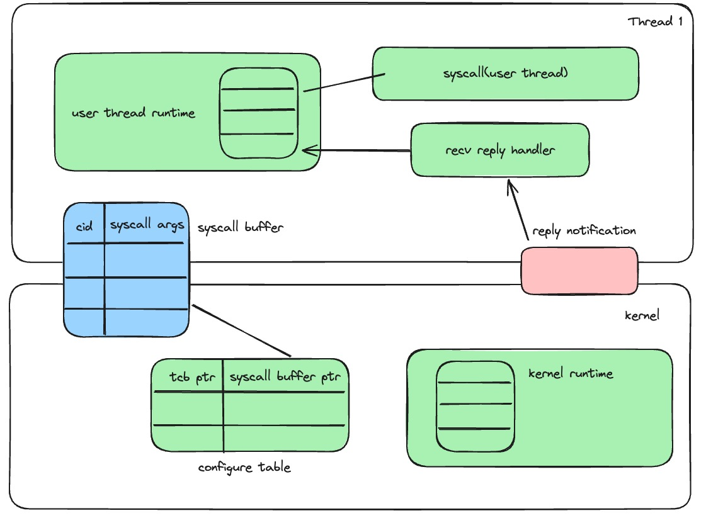

## 1. 异步IPC

两个通信线程之间需要包含共用的两个notification对象用于同步IPC的执行情况。还需要一块共享内存用于缓存IPC消息。

### 1.1 注册

客户端和服务端分别注册send和reply的notification对象，同时注册一块共享内存用于传输IPC数据。
- send notification：客户端通过send notification(irq)通知服务端已经发送对应IPC请求，由服务端的中断处理例程唤醒对应的接收协程。
- reply notification ：服务端的接收协程读取共享内存中对应的请求，处理后写入响应，然后通过reply notification通知客户端唤醒对应的协程。

### 1.2 用户态异步运行时

为了减少CPU的空闲时间，在用户态设计异步运行时。

- 客户端：在调用sendIPC接口后，进入异步运行时库，将对应的IPC请求数据写入共享内存后，返回对应的 req id，然后将 req id作为中断号，send notification通知服务端
，切换协程。

- 服务端：在初始化之前需要先注册Recv协程到运行时中，然后切换协程，执行其他可操作的协程（数据处理，或者其他Send 协程）。等到send notification接收到信号后唤醒Recv协程，根据 irq 读取共享内存中的IPC数据，在协程中处理数据，将响应写入共享内存后通过reply notification通知客户端，然后重新切换协程。

### 1.3 发送方接收方标识符

与之前的一个endpoint cap标识一个发送方和接收方不同，这里通过一对notification对象和一块IPCBuffer内存唯一标识一组发送方和接收方。

### 1.4 IPCBuffer的同步互斥

IPCBuffer的读写粒度是条目，而发送方和接收方已经通过通知机制顺序化每个条目的读写，因此不需要额外的锁机制来保证读写安全。

### 1.5 空闲的异步运行时

当异步运行时无可执行的协程时，会主动调用 `seL4_Yield` 系统调用来将剩余的时间片分配给其他线程。需要注意的是，由于用户态中断没有重新代理给内核，因此任何阻塞在内核态的行为都将无法被用户态中断唤醒。

### 1.6 乱序性分析

## 2. 异步系统调用

### 2.1 注册

一个需要异步系统调用的线程需要将自己的TCB和用于填充请求的syscall buffer frame注册给内核，同时还需要一个notification对象用于通知唤醒对应的用户态协程。
- syscall bufffer：用于存储系统调用的参数。
- reply notification：绑定到发起异步系统调用的TCB。

用户态运行时先申请分配一个frame和notification对象，然后用 bind_notification 绑定到自己的 tcb 中，最后调用新增系统调用 `configure_async_syscall` ，在内核中将自己的 tcb ptr和刚分配的 syscall buffer ptr写入配置表中。

### 2.2  内核执行

内核在每次时钟中断是会读取和便利配置表中的所有 buffer 的所有请求，执行请求后根据tcb绑定的notification来唤醒用户态协程。

### 2.3 同步互斥

configure table只会在内核中读取和写入，内核有大锁，不需要额外的同步互斥。

syscall buffer 会在用户写入，内核中读出，因此需要额外的同步护持。

## 3. 将内核看作一个特殊的应用进程

将内核看作一个特殊的应用进程，仿照异步IPC的形式实现异步系统调用。

### 3.1 观点一：在双页表场景下，内核与应用进程的对等的

没有疑问。微内核中没有进程的概念，或许可以把相同地址空间的线程当作一个进程，那`进程中的每一个线程`就与`执行内核的每一个核心`等价。

### 3.2 观点二：在双页表场景下，系统调用与IPC是统一的

从逻辑上来说是这样的，但在实现细节上一点疑问：
- 在异步IPC中，请求方通过用户态中断的硬件机制来自动实现将中断信号发送到对应的某一个线程上。而在系统调用中，所有的执行内核的核心（对应的用户态的线程概念）都有可能接收到系统调用的请求，那具体是哪个核心来响应请求和处理请求？总结来说是：在IPC中接收方是单目标（单个线程），而在系统调用中接收方是内核（一个进程，对应的是多个CPU核心）。
- 从用户态的异步运行时来看，每一个异步IPC或者异步系统调用都需要发送一个中断请求，然后切换整个用户协程（也就是说，每个中断号都对应了一个协程号），直到请求被完成之后才能把对应的中断字清空。由于用户态中断只支持64个中断号，对于IPC而言，一个接收方最多并发处理64个请求还算可以接受，而对于内核而言，整个操作系统系统并发处理64个系统调用是否可以接受？

### 3.3 观点三：内核是一个事件响应机构，系统调用请求和设备中断请求都是内核需要响应的事件。

没有疑问。实现细节需要考虑，如何将系统调用请求转化为一个由用户态发送给内核态的中断。之前讨论的是用户态陷入内核但不切换上下文，然后发送核间中断。这里的问题有两个：
- 不切换上下文，是指不切换页表（这个或许还算比较容易做到），还是指不保存寄存器现场（不保存寄存器现场的话，后续的发送核间中断的操作需要使用汇编指令，也需要简单保存和恢复几个临时寄存器）。
- 核间中断发送给谁？理论上可以发送给除当前核心外的其他任何核心。

### 3.4  观点四：异步机制的效率
体现在：
- 减少或避免上下文切换：
	- 同意：异步系统调用减少用户态和内核态的上下文切换开销，这一点没有异议。
- 在有任务执行时，避免等待：
	- 同意

这里的分歧在于：是否在内核使用基于中断的唤醒机制？向老师的观点在于使用中断，我的观点在于直接使用共享缓冲区，内核通过定时器中断轮询共享缓冲区来实现。
- 疑问：在向老师构想异步系统调用的实现中，核间中断的处理是用于唤醒内核中的Recv协程（因为唤醒操作实际上只是将协程加入就绪队列中），而唤醒后的Recv协程何时执行？或者说整个内核的异步运行时是何时执行的？我当前想到的是在每次时钟中断时检查就绪队列中是否有就绪协程，然后进行执行。但这种方式和第2章提到的使用 syscall buffer 来遍历的方式并没有什么本质区别，可能会减少部分的同步互斥的开销，但频繁的核间中断开销或许也难以忽略，不好进行评估。
