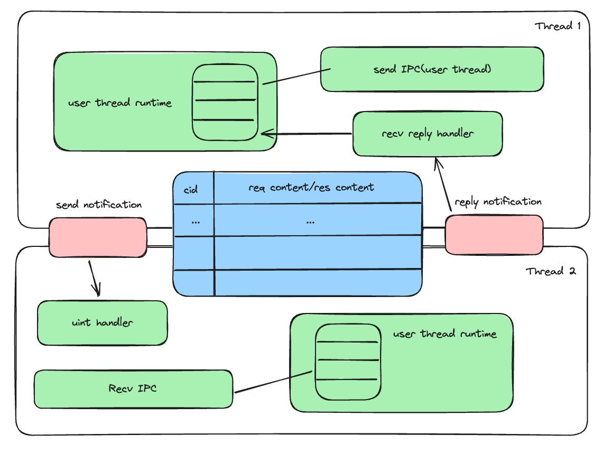

## 异步IPC

两个通信线程之间需要包含共用的两个notification对象用于同步IPC的执行情况。还需要一块共享内存用于缓存IPC消息。

### 注册

客户端和服务端分别注册send和reply的notification对象，同时注册一块共享内存用于传输IPC数据。
- send notification：客户端通过send notification(irq)通知服务端已经发送对应IPC请求，由服务端的中断处理例程唤醒对应的接收协程。
- reply notification ：服务端的接收协程读取共享内存中对应的请求，处理后写入响应，然后通过reply notification通知客户端唤醒对应的协程。

### 用户态异步运行时

为了减少CPU的空闲时间，在用户态设计异步运行时。

- 客户端：在调用sendIPC接口后，进入异步运行时库，将对应的IPC请求数据写入共享内存后，返回对应的 req id，然后将 req id作为中断号，send notification通知服务端
，切换协程。

- 服务端：在初始化之前需要先注册Recv协程到运行时中，然后切换协程，执行其他可操作的协程（数据处理，或者其他Send 协程）。等到send notification接收到信号后唤醒Recv协程，根据 irq 读取共享内存中的IPC数据，在协程中处理数据，将响应写入共享内存后通过reply notification通知客户端，然后重新切换协程。

### 发送方接收方标识符

与之前的一个endpoint cap标识一个发送方和接收方不同，这里通过一对notification对象和一块IPCBuffer内存唯一标识一组发送方和接收方。

### IPCBuffer的同步互斥

IPCBuffer的读写粒度是条目，而发送方和接收方已经通过通知机制顺序化每个条目的读写，因此不需要额外的锁机制来保证读写安全。

### 空闲的异步运行时

当异步运行时无可执行的协程时，会主动调用 `seL4_Yield` 系统调用来将剩余的时间片分配给其他线程。需要注意的是，由于用户态中断没有重新代理给内核，因此任何阻塞在内核态的行为都将无法被用户态中断唤醒。

## 乱序性分析

## 异步系统调用
