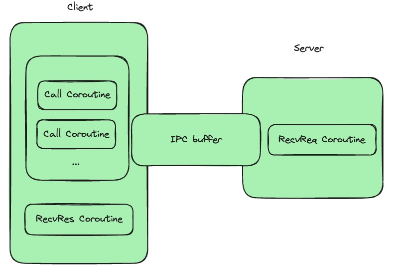
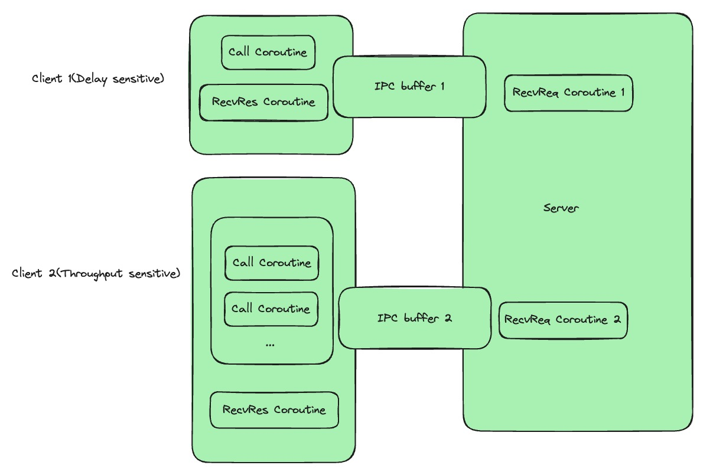
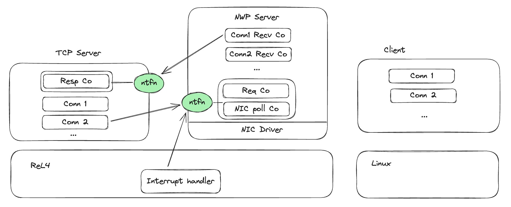

异步IPC测试指标：吞吐量（单位时间内的完成请求数量）、Call消息延迟（从发起到完成的延迟）、用户态中断触发次数。

变量：客户端负载（通过并发请求的数量来衡量）、服务端负载（矩阵乘法的规模来衡量以及并发请求数量）。

不同的工作负载要求：高并发工作负载（不关心延迟，关心吞吐量）、低延迟负载（不关心吞吐量、关心延迟），混合负载（低延迟call不允许被高并发负载过多干扰）。

### 1. 高并发工作负载

高并发工作负载需要客户端尽可能多地发起请求（采用异步进行并发），而服务端尽可能多地处理请求（由于Server只需要片刻不停地处理请求即可， 采用并发可能会导致额外的开销，因此顺序处理即可）。

变量：
- 客户端并发数量。
- 服务端负载。
预期结果：
- 吞吐量：在服务端负载较轻的时候，吞吐量随着客户端并发数量增加而增加。在服务端负载较重的时候，吞吐量受到服务端的处理速度限制。
- Call消息延迟：随着客户端并发数量增加，Call消息延迟长尾分布会越发明显。而随着服务端负载加重，消息延迟分布的峰值会后移。
- 用户态中断次数：
	- 服务端的用户态中断次数：随着客户端并发数量的增加或者服务端负载加重，服务端的中断次数会减少。
	- 客户端的用户态中断次数：在服务端负载轻的情况下，随着客户端并发数量增加，客户端中断次数会减少。而随着服务端负载加重，客户端的中断次数会增加。

## 2. 低延迟工作负载

客户端并发数量为1时为低延迟工作负载，此时退化为同步IPC调用。

变量：
- 服务端负载

预期结果：
- 吞吐量：随服务端负载增加而减少。
- Call 消息延迟：随服务端负载增加而增加。
- 用户态中断次数：
	- 服务端的用户态中断次数：随服务端负载增加而减少。
	- 客户端的用户态中断次数：随服务端负载增加而增加。

## 3. 混合工作负载

延迟敏感型负载在Server端的优先级要高于吞吐量敏感性负载。这里的目标是要保证在高吞吐量负载正常工作情况下不影响少量的延迟敏感型负载（因为过多的延迟敏感型负载会使得整个系统退化为同步调用）。

变量：
- Delay sensitive 客户端请求频率
- Throughput sensitive 客户端并发量

预期结果：
- 吞吐量：随着Delay sensitive 客户端请求频率增加而减少。
- Call 消息延迟：Delay sensitive的消息延迟或许会随着服务端负载的增加而有一点上升。
- 用户态中断次数：
	- 服务端中断次数：会随着Delay sensitive 客户端请求频率增加而显著增加。

## 网络协议栈框架

微内核将网络协议栈作为一个用户态任务（NWP Server），其他网络服务器任务通过与NWP Server通信来使用网络服务，因此NWP Server作为一个频繁进行IPC的任务，用于对异步IPC的性能测试具有较好的说服力。

同步IPC由于其阻塞的性质，其每个tcp连接由一个线程负责，各个线程通过endpoint来与NWP Server通信，而NWP Server则通过维护一个endpoint队列，并不断轮询endpoint队列来处理网络请求。