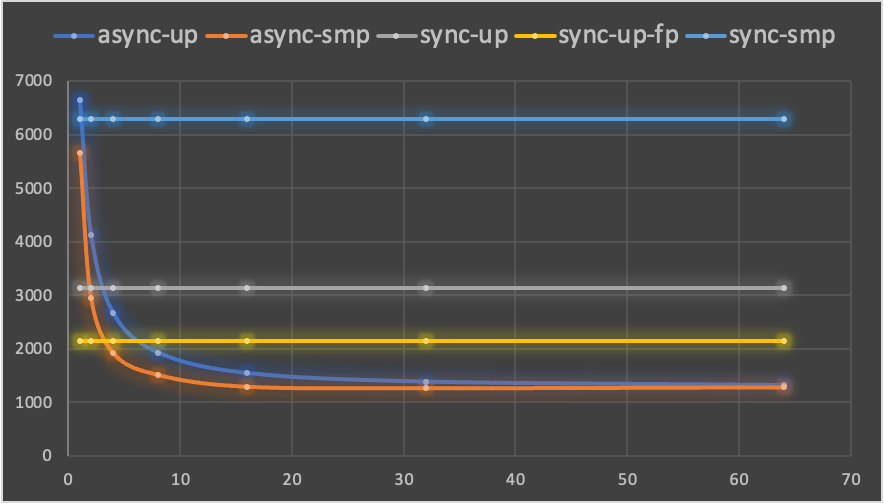
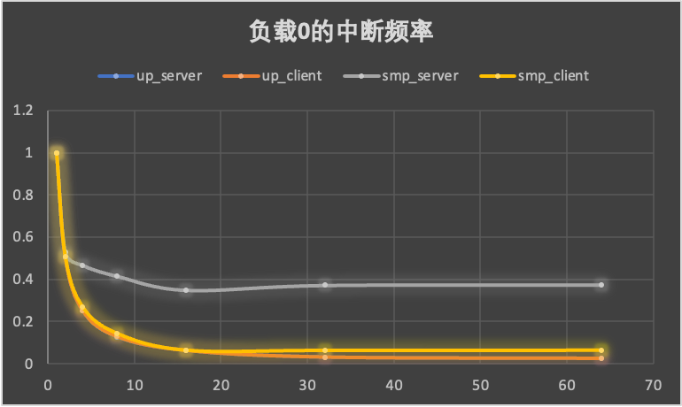
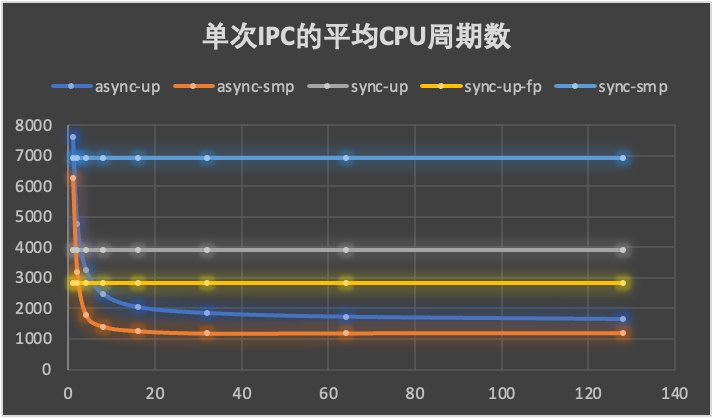
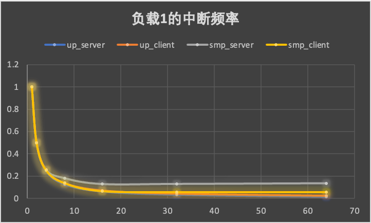
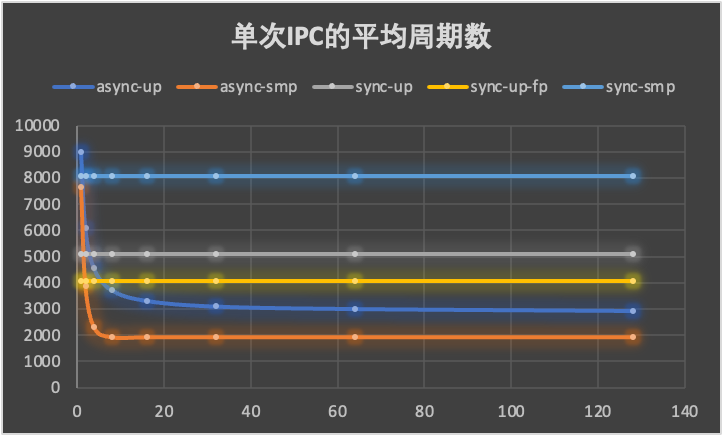
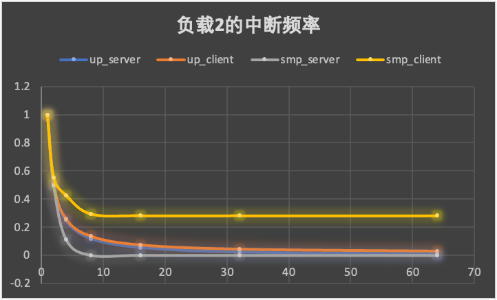

## 1. 微基准

我们关心异步IPC的平均周期数的影响因素，预期的影响因素有并发度（客户端负载）和服务端负载。

## 1.1 服务端无额外负载

- 横坐标是并发量，纵坐标是平均周期数。
- async_up: 单核异步，客户端和服务端都在同一个核心上。
- async_smp: 多核异步：客户端和服务端在两个不同核心上。
- sync_up_fp: 单核同步，且开启了fastpath。
- sync_smp: 多核同步，客户端和服务端在两个不同核心上。

- 这里只有异步IPC涉及到用户态中断。
- 横坐标是并发量，纵坐标是用户态中断频率的比率。

分析：
- 从总体上来看，异步IPC随着并发量的增加，平均开销减少。并发量的增加减少了任务切换的次数和用户态中断的次数。
- 单核情况下异步比同步提升72.94%(152.7%)（开启fp和不开启fp）。
- 多核情况下异步比同步提升387.8 %，这是由于多核下同步IPC额外会有核间通信的开销。
- 只看异步，在并发度低的时候，多核会略快于单核，符合预期，随着并发度的逐渐增加，多核逐渐被单核追上，这是由于多核情况下服务端单独使用一个核心，导致服务端负载过小，产生了更加频繁的用户态中断，导致服务端吞吐量过小，又反过来限制了客户端的发起频率。

## 2.2 服务端负载适中

分析：
- 总体趋势依然符合1.1节的第一点结论。
- 单核情况下异步比同步性能提升71.59%(137.7%)（开启fp和不开启fp）。
- 多核情况下异步比同步性能提升478.8%。
- 只看异步，多核明显会好于单核，符合预期。
- 多核异步在适当负载情况下表现要好于0负载（1200 vs 1288），这是由于服务端和客户端在适当的负载下（大体相当），系统中的用户态中断频率是最低的，因此此时的性能是最高的。

## 1.3 服务端过载

分析：
- 总体趋势依然符合1.1节的第一点结论。
- 单核情况下异步比同步性能提升38.74%(73.54%)（开启fp和不开启fp）。
- 多核情况下异步比同步性能提升319.8%。
- 多核异步下，在并发量超过8时，服务端已经满载（中断频率将为0，即接收协程将一直工作），此后再增加并发度，将没有任何效果。