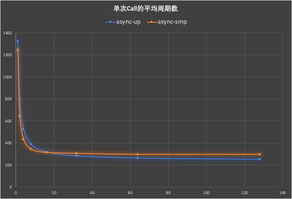
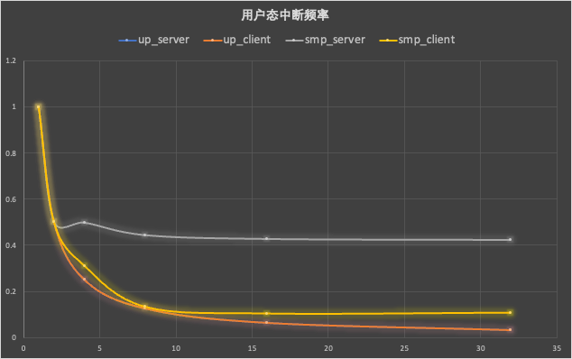
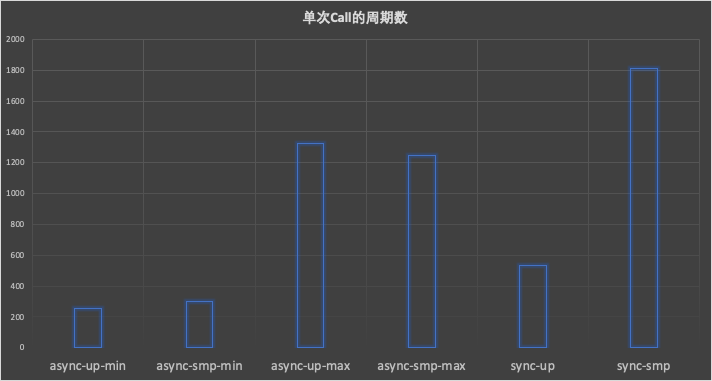
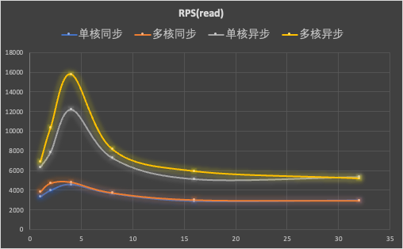
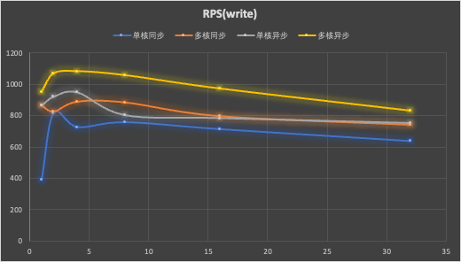
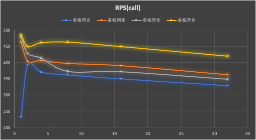
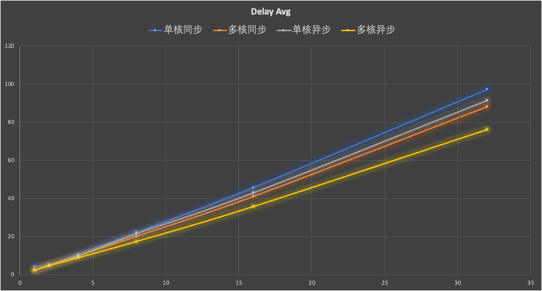

## 1. 微基准测试

我们关心异步IPC的平均周期数的影响因素，预期的影响因素有并发度（客户端负载）和服务端负载。我们测量了在不同并发度下用IPC传输一个字节数据并返回一个字节响应的平均CPU周期数，结果如下：

- 横坐标是并发量，纵坐标是平均周期数。
- async_up: 单核异步，客户端和服务端都在同一个核心上。
- async_smp: 多核异步：客户端和服务端在两个不同核心上。

在多核中，当并发度小的时候，性能比单核的异步IPC要好，而在并发度大的时候，性能会渐渐低于单核，这是由于由于服务端独占一个核心，导致服务端负载较小，产生了比单核更加频繁的用户态中断，从而产生了额外开销，下面是用户态中断频率随着并发度的变化数据：

- 横坐标是并发量，纵坐标是用户态中断频率的比率。

可以看到随着请求并发度的增加，单次Call的平均开销是不断减小的，与同步的IPC相比，高并发度的负载中有着良好地表现：

当并发度为1时，异步IPC退化为同步IPC，此时在单核下的性能(async_up_max)低于单核同步的性能，这是由于额外的调度器成本和用户态中断导致的，而多核情况(async_smp_max)下，虽然有着额外的调度器成本和用户态中断成本，但仍然要小于同步IPC中的核间中断的成本开销。

## 2. 网络协议栈性能测试

由于比较的是IPC对于网络协议栈性能的提升，因此本次试验中的收发的数据包均为小包（1 byte）。

### 2.1 Socket Read

- 横坐标是连接数，纵坐标是吞吐量（每秒接收多少个包）。

TCP Server只进行读操作，由于外部的客户端发送的若干个小包通过合并的方式减少了外部中断的次数（测试之后仅有几次网卡中断），此时的场景可以近似于有一定工作负载（网络协议栈处理）的简单IPC服务器。

可以看出，在并发量很少时（为1、2、4），此时的NWP负载未能打满，因此随着并发度的增加，RPS会增加。而随着并发量的增加，包合并之后发送过来在smoltcp这里第一次poll的时间飞速增加，因此，性能开始下降。但从对比的角度来看，这些都属于协议栈内部的开销，跟同步和异步无关，因此无需进行消除。

从总体上来看，异步IPC的NWP Server性能在读性能要比同步IPC的NWP Server高77.5%～229%。

### 2.2 Socket Write

TCP Server只进行读操作。由于每发送一个包就会触发甚至多次网卡中断（返回响应），因此CPU的大部分时间都被协议栈的Poll操作占据，同时会有频繁的被中断打断的开销，因此随着并发度的增加，性能总体呈下降的趋势。从总体上来看，仍然符合多核比单核好，异步比同步好的趋势。异步IPC的NWP Server性能在写性能要比同步IPC的NWP Server高10.2%～29.1%。

异常点：
- 单核同步的情况下，连接数为1 时的性能过低。

### 2.3 Socket Call

TCP Server交替进行读写操作（即客户端进行一个Call）。从上面两个实验可以看出，一个Call的主要性能瓶颈在于Write操作，因此Socket Call的对比图和Socket Write 类似，异步IPC的NWP Server性能在写性能要比同步IPC的NWP Server高4.7%～16.6%。：

异常点：
- 单核同步的情况下，连接数为1 时的性能过低。（同上）

异常点：
-  单核同步的情况下，连接数为1 时的延迟较高。（同上）

延迟方差数据如下：

| 连接数  | 1     | 2    | 4     | 8      | 16      | 32      |
| ---- | ----- | ---- | ----- | ------ | ------- | ------- |
| 单核同步 | 23.2  | 2.39 | 10.58 | 22.14  | 48.37   | 126.99  |
| 多核同步 | 0.059 | 4.32 | 8.86  | 19.41  | 49.35\| | 104.28  |
| 单核异步 | 0.04  | 2.4  | 18.11 | 543.13 | 1270.47 | 5444.34 |
| 多核异步 | 0.09  | 0.48 | 1.13  | 2.78   | 2.78    | 11.22   |
 - 异常点：单核异步的方差随着并发量的增加，增长速度很快。
	 - 对比单核同步来看，由于异步请求和响应在接收时常常被高频率的网络中断打断，而同步的请求和响应的传输往往在内核态，因此可被打断点比异步要少，不确定性更低，反映下来就是方差小。
	 - 对比多核异步来看：由于NWP运行在核1上，此时的网络中断只会打断核0的任务（TCP Server），而单核下可能会打断NWP Server和TCP Server两者，因此多核下的不确定性更低，反映下来就是方差小。