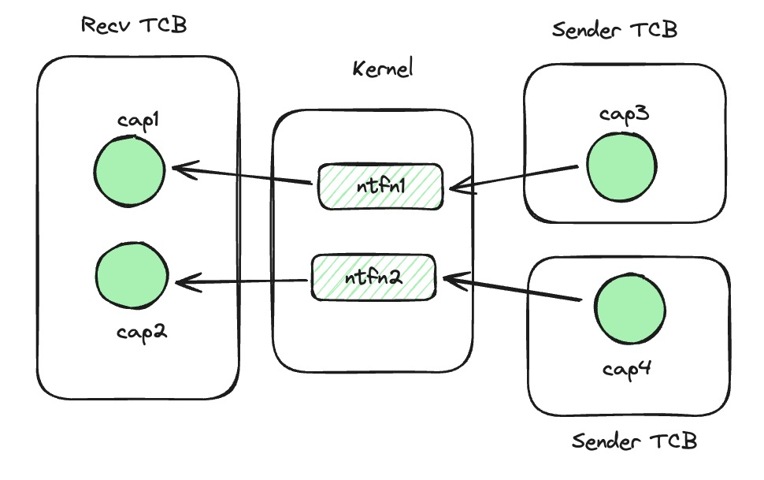

## 注册

seL4下的通知机制允许一个线程通过一个内核对象的句柄（cap）向另一个线程非阻塞地发送信号。其注册过程在在用户态一共涉及到三个API：
- `seL4_Untyped_Retype`: 将一片未被使用的内存初始化为一个Notification内核对象。
- `seL4_CNode_Mint`: 从原始的notification cap中派生一个新的被赋予了标记的cap作为发送端标记（badged_ntfn_cap）。
- `seL4_TCB_BindNotification`: 将notification对象绑定到某个线程，只有绑定线程可以通过cap来接收这个notification对象的信号。

而用户态中断允许线程通过硬件寄存器直接向另一个线程发送中断信号。因此我们使用用户态中断来改造seL4下的通知机制。首先需要扩展notification内核对象：

新增一个机器字，前9位存储notification对象对应的UINTC中的存储receiver status表项的index（记为recv_idx)，第10位标记当前notification对象是否已经注册了receiver status表项。
新增系统调用：
- `seL4_Uint_Notification_register_receiver`： 通过ntfn cap来将tcb注册为用户态中断接收端。
- `seL4_Uint_Notification_register_sender`：通过ntfn cap来将当前tcb注册为用户态中断发送端，返回send id，后续通过 `uipi_send(send_id)` 来发送信号。

然后需要将其余的注册过程融入上面三个API中：
- `seL4_Untyped_Retype`: 与之前相同，将一片未被使用的内存初始化为一个Notification内核对象。
- `seL4_CNode_Mint`：与之前相同，从原始的notification cap中派生一个新的被赋予了标记的cap作为发送端标记（badged_ntfn_cap）。
- `seL4_TCB_BindNotification`：在之前的基础上，继续调用`seL4_Uint_Notification_register_receiver`系统调用，来将TCB注册为接收端。

由于原始的通知机制发送端无需注册，只需要拿到对应的ntfn cap即可进行发送，因此我们将用户态中断的发送端注册后移到第一次发送中。
> ps. 这里的`seL4_TCB_BindNotification`在修改后有语义上的变化，原始的API接口是让TCB独占这个ntfn接收端，其他线程无法再接受这个ntfn的通知。而修改后的接口是TCB和ntfn接收端相互独占的。


## 通信权限控制

在原始的通知机制中，通信权限的控制是通过capability来进行的，如果将通信看做一张有向图，那图的顶点就是指向ntfn内核对象的capability，指向同一个内核对象且拥有发送权限的的就是一条边。



发送线程和接受线程可以通过显式指定capability来选择发送方和接收方。

```rust
seL4_Signal(ntfn_cap);
seL4_Wait(ntfn_cap);
```

而在用户态中断改造之后的通知机制，发送端仍然可以维护 ntfn cap 到 send id 的映射来将ntfn cap看作发送端顶点，而接收端的顶点则必须是绑定了内核对象的TCB。


由于用户态中断的内核对象对接收线程的独占性，接收线程无法再通过不同的内核对象来区分不同的接收方，以至于接收线程在接收时不需要指定参数。当然我们用类似处理发送端的方法来在接收方的用户态做兼容性处理，但考虑到大多数情况下一个接收端通过一个内核对象和不同的badge来区分不同的发送方已经足够，因此我们这里没有进行过多的兼容性处理。


## 通信

发送：
- 原始的接口为`seL4_Signal(ntfn_cap)` ，陷入内核态修改内核对象的信号字后返回用户态。
- 修改后，我们在用户态的发送线程运行时中维护一个ntfn_cap的注册状态表，在 `seL4_Signal` 中将首先检查入参的cap是否注册了发送端，如果没有注册，则会调用 `seL4_Uint_Notification_register_sender` 注册发送端，然后将从内核态拿到的 `send id` 用于更新状态表，最后通过 `uipi_send(send_id)` 来发送信号。如果之前已经注册过了，则直接从状态表中拿到 `send id` 并调用 `uipi_send(send_id)` 。

接收：
- 原始的接收端使用两个接口来陷入内核态获取信号字：
	-  `seL4_Wait(ntfn_cap)` : 陷入内核态，当没有信号时，当前线程将阻塞在内核态。
	-  `seL4_Poll(ntfn_cap)` : 陷入内核态，当没有信号时，直接返回用户态。
- 修改后，当设置了中断处理函数时，我们不需要主动调用上面两个接口来询问信号。为了兼容性，我们对上述两个接口做了适配：
	-  `seL4_Wait(ntfn_cap)`: 由于用户态中断的相互独占的性质，入参将被忽略，调用 `uipi_read()` 来读取中断寄存器，如果没有信号，则调用 `yield_now().await` 切换当前协程。 
	-  `seL4_Poll(ntfn_cap)`：同样忽略入参，调用 `uipi_read()`，直接返回读取结果。


## 内核适配

扩展notification对象

```rust
plus_define_bitfield! {  
    notification_t, 5, 0, 0, 0 => {  
        new, 0 => {  
            ...
            uintr_flag, get_uintr_flag, set_uintr_flag, 4, 9, 1, 0, false,  
            recv_idx, get_recv_idx, set_recv_idx, 4, 0, 9, 0, false  
        }  
    }
}
```

注册接收端：
```rust
pub fn register_receiver(ntfn: &mut notification_t, tcb: &mut tcb_t) {  
    if tcb.tcbBoundNotification != ntfn.get_ptr() {  
        debug!("fail to register uint receiver, need to bind ntfn first");  
        return;  
    }
    if let Some(recv_index) = UINTR_RECV_ALLOCATOR.lock().allocate() {  
        ntfn.set_uintr_flag(1);  
        ntfn.set_recv_idx(recv_index);  
        let mut uirs = UIntrReceiver::from(recv_index);  
        uirs.irq = 0;  
        uirs.sync(recv_index);  
        tcb.uintr_inner.utvec = uintr::utvec::read().bits();  
        tcb.uintr_inner.uscratch = uintr::uscratch::read();  
    } else {  
        debug!("register_receiver fail");  
    }
}
```


注册发送端：
```rust
pub fn register_sender(ntfn_cap: &cap_t) {  
    assert_eq!(ntfn_cap.get_cap_type(), CapTag::CapNotificationCap);  
    let current = get_currenct_thread();  
    if current.uintr_inner.uist.is_none() {  
        if let Some(uist_idx) = UINTR_ST_POOL_ALLOCATOR.lock().allocate() {  
            current.uintr_inner.uist = Some(uist_idx);  
        } else {  
            debug!("alloc sender table fail");  
            return;  
        }
    }    
    let uist_idx = current.uintr_inner.uist.unwrap();  
    let uiste_idx = UINTR_ST_ENTRY_ALLOCATOR.lock().get_mut(uist_idx).unwrap().allocate();  
    if uiste_idx.is_none() {  
        debug!("fail to alloc uiste. {}", uist_idx);  
        return;  
    }
    let offset = uiste_idx.unwrap();  
    let entry = unsafe {  
        convert_to_mut_type_ref::<UIntrSTEntry>(UINTR_ST_POOL.as_ptr().offset(((uist_idx * UINTC_ENTRY_NUM + offset) * core::mem::size_of::<UIntrSTEntry>()) as isize) as usize)  
    }; 
    entry.set_valid(true);  
    // badge是之前调用 seL4_CNode_Mint 进行赋值的，用于区分同一个ntfn对象的不同发送端，在用户态中断中被设置为发送端的中断号
    entry.set_vec(ntfn_cap.get_nf_badge());  
    entry.set_index(convert_to_type_ref::<notification_t>(ntfn_cap.get_nf_ptr()).get_recv_idx());  
    let ipc_buffer = current.lookup_mut_ipc_buffer(true).unwrap();  
    // offset作为send id返回给用户态
    ipc_buffer.uintrFlag = offset;  
}
```

在发送端线程返回用户态时，需要设置suist寄存器：
```rust
unsafe fn uist_init() {  
    if let Some(uist_idx) = get_currenct_thread().uintr_inner.uist {  
        let frame_addr = UINTR_ST_POOL.as_ptr().offset((uist_idx * core::mem::size_of::<UIntrSTEntry>() * UINTC_ENTRY_NUM) as isize) as usize;   
        uintr::suist::write((1 << 63) | (1 << 44) | (kpptr_to_paddr(frame_addr) >> 0xC));  
    } else {  
        uintr::suist::write(0);  
    }
}
```

而在接收端线程返回时，同样需要设置中断代理寄存器：
```rust
unsafe fn uirs_restore() {  
    let current = get_currenct_thread();  
    if let Some(ntfn) = convert_to_option_mut_type_ref::<notification_t>(current.tcbBoundNotification) {  
        if ntfn.get_uintr_flag() == 1 {  
            let index = ntfn.get_recv_idx();  
            let mut uirs = UIntrReceiver::from(index);  
            uirs.hartid = {  
                #[cfg(feature = "ENABLE_SMP")] {  
                    crate::smp::cpu_index_to_id(cpu_id())  
                }                
                #[cfg(not(feature = "ENABLE_SMP"))]  
                0 
            } as u16;  
            uirs.mode |= 0x2;  
            uirs.sync(index);  
  
            // user configurations  
            uintr::uepc::write(current.uintr_inner.uepc);  
            uintr::utvec::write(current.uintr_inner.utvec, uintr::utvec::TrapMode::Direct);  
            uintr::uscratch::write(current.uintr_inner.uscratch);  
            uintr::uie::set_usoft();  
  
            // supervisor configurations  
            uintr::suirs::write((1 << 63) | (index & 0xffff));  
            uintr::sideleg::set_usoft();  
            if uirs.irq != 0 {  
                sip::set_usoft();  
            } else {  
                sip::clear_usoft();  
            }            
            return;  
        }
    }    
    uintr::suirs::write(0);  
    uintr::sideleg::clear_usoft();  
    sip::clear_usoft();  
}
```