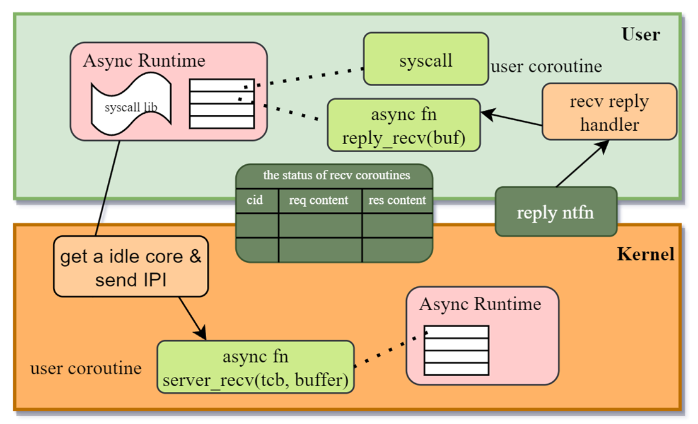
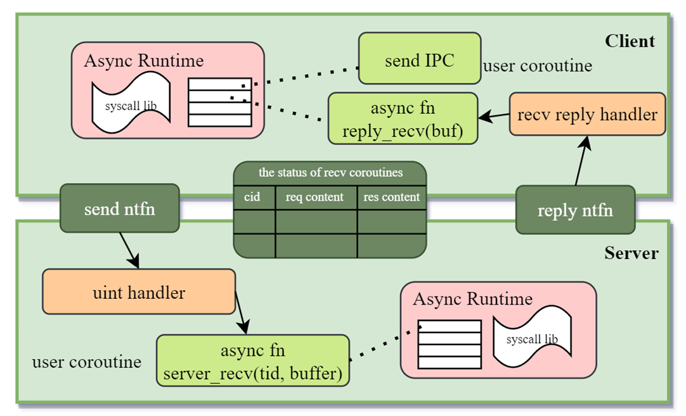

## 1. 异步系统调用

异步系统调用架构分为用户态和内核态两个部分。用户态提供的异步协程运行时允许用户态在等待系统调用结果时可以执行其他协程来减少CPU等待时间，实现分时并发；内核态提供的接受请求的协程则允许内核使用其他CPU核心来出处理系统调用请求，实现同时并行。

- 用户态运行时：在用户态运行时库中提供新的系统调用接口，待运行时初始化完成后，所有的用户态执行流都被封装到一个协程中，在协程中调用的系统调用会链接到新提供的运行时库中，将请求提交到syscall buffer，然后切换到其他协程进行执行。
- 内核运行时：内核启动后会维护一个内核运行时，在刚启动时为空，当有线程注册了异步系统调用的运行时之后，会新建一个Recv协程，添加到内核运行时，用于处理该线程的异步系统调用请求。
- 注册：用户态准备一块共享内存用于存放系统调用请求参数和请求结果等数据。然后调用 `register_async_syscall` 系统调用，在内核运行时中新建一个内核协程，该协程会遍历共享内存中的请求，当没有请求时会挂起该协程。（一个线程对应一个syscall buffer，对应一个内核协程）。
- 提交异步系统调用请求：用户态运行时在提交系统调用请求时会检查当前线程对应的内核协程是否已经被唤醒（syscall buffer 中维护一个用户态可读的原子变量来获取内核协程状态）。
	- 如果对应的内核协程是被唤醒的，则将请求写入buffer后直接切换用户协程。
	- 如果对应的内核协程没有被唤醒，则陷入内核态，将对应的内核协程唤醒，并检查所有的核心上运行的线程优先级：
		- 如果提交线程的优先级高于某个核心上运行的线程优先级：则可以向核心发送IPI中断，抢占让其执行内核协程。
		- 如果没有（所有的核心都在忙于处理更高优先级用户态程序）：则直接返回到用户态切换用户协程，等到某个核心的时钟中断到来时再处理内核协程。
- 提交异步系统调用结果：内核协程在执行时能够很轻松的知道当前请求发起者（tcb，cid），以及tcb对应的syscall buffer，因此在处理完请求之后将对应的结果写入syscall res条目中，并根据tcb绑定的notification对象通知用户态中断处理程序，唤醒对应的用户态协程。

## 2. 异步IPC

异步IPC和异步系统调用类似，唯一的两点区别在于注册和提交IPC请求时：
- 注册：客户端除了需要将ipc buffer注册给服务端之外，还需要注册一个notification的发送端，用于客户端唤醒对应的服务端接收协程。
- 提交IPC请求：同样会在ipc buffer中维护接收协程的运行状态：
	- 如果是唤醒的：直接将请求写入ipc buffer后切换用户协程即可。
	- 如果不是唤醒的：通过notification发送用户态中断，由用户态中断处理程序来唤醒对应的服务端协程。

## 3. IPC/syscall buffer 的同步互斥

为了统一IPC/syscall，通信双方后续被称为发方和收方。

buffer中会维护一个对应协程状态的标志位，被设置为原子变量，由发方可读，收方可写。不需要额外的同步互斥。

而对于请求参数和请求结果的队列而言，需要额外的同步互斥操作来保证读写安全，第一版实现可以用简单的自旋锁实现基本功能，第二版将借鉴io_uring，改进为无锁的环形队列。

## 4. 空闲的异步运行时

当用户态的异步运行时没有其他可以执行的协程时，可以调用 `seL4_Suspend` 将阻塞线程，等到用户态中断的到来。由于用户态中断收方不在线，因此需要通过内核转发唤醒。

而内核态的异步运行时没有其他可以执行的协程时，会重新调度用户态的线程。

## 5. 用户态中断的IRQ含义

这里面总共涉及到两处用户态中断的使用。

- 第一处是异步IPC的客户端需要使用用户态中断来唤醒服务端对应的协程：此处的IRQ代表客户端线程的tid。
- 第二处是异步IPC/syscall的收方通知发放已经完成的请求：此处的IRQ代表需要唤醒的客户端的cid。

## 6. 乱序性分析

同一个线程内的请求根据队列的排列，将被同一个接收协程依次处理，因此同一个线程内的请求将是顺序的。

不同线程间的请求将由不同的接收协程进行处理，由于通知机制的异步性，可能会存在乱序性，可以用额外的notification对象进行同步。