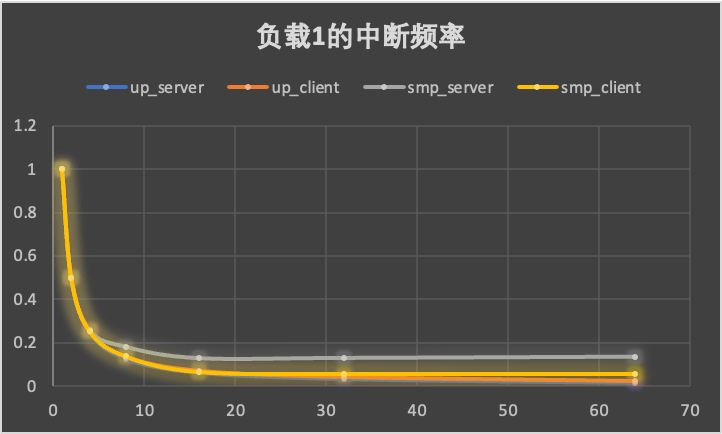

## 1. 微基准

我们关心异步IPC的平均周期数的影响因素，预期的影响因素有并发度（客户端负载）和服务端负载。

## 1.1 服务端无额外负载

- 横坐标是并发量，纵坐标是平均周期数。
- async_up: 单核异步，客户端和服务端都在同一个核心上。
- async_smp: 多核异步：客户端和服务端在两个不同核心上。
- sync_up_fp: 单核同步，且开启了fastpath。
- sync_smp: 多核同步，客户端和服务端在两个不同核心上。

- 这里只有异步IPC涉及到用户态中断。
- 横坐标是并发量，纵坐标是用户态中断频率的比率。

分析：
- 从总体上来看，异步IPC随着并发量的增加，平均开销减少。并发量的增加减少了任务切换的次数和用户态中断的次数。
- 在并发度高于64时单核情况下异步比同步提升72.94%(152.7%)（开启fp和不开启fp）。
- 在并发度高于64时多核情况下异步比同步提升387.8 %，这是由于多核下同步IPC额外会有核间通信的开销。
- 只看异步，在并发度低的时候，多核会略快于单核，符合预期，随着并发度的逐渐增加，多核逐渐被单核追上，这是由于多核情况下服务端单独使用一个核心，导致服务端负载过小，产生了更加频繁的用户态中断，导致服务端吞吐量过小，又反过来限制了客户端的发起频率。

## 2.2 服务端负载适中

分析：
- 总体趋势依然符合1.1节的第一点结论。
- 单核情况下异步比同步性能提升71.59%(137.7%)（开启fp和不开启fp）。
- 多核情况下异步比同步性能提升478.8%。
- 只看异步，多核明显会好于单核，符合预期。
- 多核异步在适当负载情况下表现要好于0负载（1200 vs 1288），这是由于服务端和客户端在适当的负载下（大体相当），系统中的用户态中断频率是最低的，因此此时的性能是最高的。

## 1.3 服务端过载

分析：
- 总体趋势依然符合1.1节的第一点结论。
- 单核情况下异步比同步性能提升38.74%(73.54%)（开启fp和不开启fp）。
- 多核情况下异步比同步性能提升319.8%。
- 多核异步下，在并发量超过8时，服务端已经满载（中断频率将为0，即接收协程将一直工作），此后再增加并发度，将没有任何效果。

## 1.4 服务端中断频率随负载变化图

- 横坐标是服务端计算负载级别，越高代表负载越大。
- 纵坐标为服务端的中断频率（次/每条call请求）。
可以看出，随着服务端的计算负载增加，服务端的用户态中断逐渐降低。同时，随着客户端并发度的增加，服务端的负载也会增加，从而中断频率减少（并发度16的中断频率小雨并发度为8和4的）。

# 2. 网络协议栈性能测试

由于比较的是IPC对于网络协议栈性能的提升，因此本次试验中的收发的数据包均为小包（64 bytes）。
## 2.1 Socket Read

- 横坐标是连接数，纵坐标是吞吐量（每秒接收多少个包）。

TCP Server只进行读操作，由于外部的客户端发送的若干个小包通过合并的方式减少了外部中断的次数（测试之后仅有几次网卡中断），此时的场景可以近似于有一定工作负载（网络协议栈处理）的简单IPC服务器。

可以看出，在并发量很少时（为1、2、4），此时的NWP负载未能打满，因此随着并发度的增加，RPS会增加。而随着并发量的增加，包合并之后发送过来在smoltcp这里第一次poll的时间飞速增加，因此，性能开始下降。但从对比的角度来看，这些都属于协议栈内部的开销，跟同步和异步无关，因此无需进行消除。

从总体上来看，异步IPC的NWP Server性能在读性能要比同步IPC的NWP Server高21.9%～107.6%。

## 2.2 Socket Write

TCP Server只进行写操作。由于每发送一个包就会触发甚至多次网卡中断（返回响应），因此CPU的大部分时间都被协议栈的Poll操作占据，同时会有频繁的被中断打断的开销，因此随着并发度的增加，性能总体呈下降的趋势。从总体上来看，仍然符合多核比单核好，异步比同步好的趋势。异步IPC的NWP Server性能在写性能要比同步IPC的NWP Server高1.7%～21.1%。
- 异常点：
	- 多核同步是一直下降的趋势，其他三个都有个先上升后下降的趋势。

## 2.3 Socket Call

TCP Server交替进行读写操作（即客户端进行一个Call）。从上面两个实验可以看出，一个Call的主要性能瓶颈在于Write操作，因此Socket Call的对比图和Socket Write 类似，异步IPC的NWP Server性能在写性能要比同步IPC的NWP Server高2.9%～15%。：

异常点：
- 单核同步在并发度为1的时候性能过低。

每个call的平均延迟符合随并发度提升线性增长的预期。

